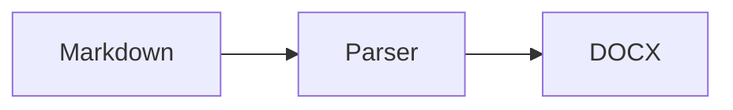
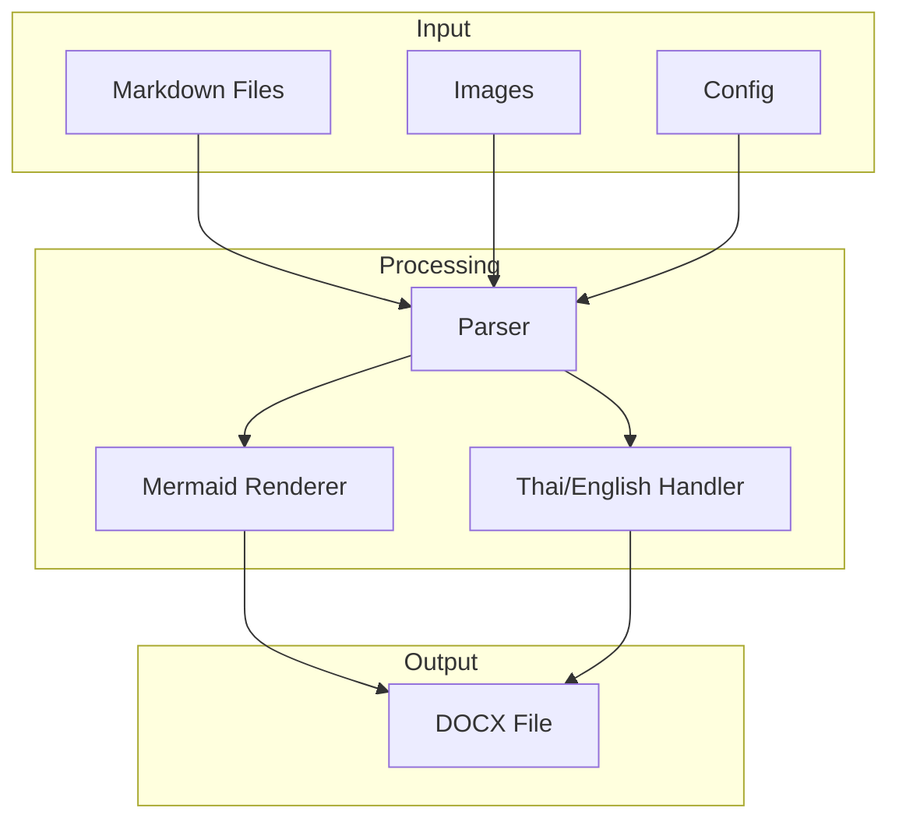

# md2docx - Markdown to DOCX Converter

## AI AGENT INSTRUCTIONS

> **READ THIS FIRST** - Instructions for AI agents (Claude, GPT, Copilot, etc.) working on this codebase.

### Quick Start for AI

```bash
# Build
cargo build --release

# Run tests
cargo test

# Build WASM
wasm-pack build --target web --features wasm
```

### Key Files to Read First

| File | Purpose | Read When |
|------|---------|-----------|
| `src/lib.rs` | Public API, main entry points | Always |
| `src/config/schema.rs` | Config structure | Modifying settings |
| `src/docx/ooxml/*.rs` | OOXML XML generation | Fixing DOCX output |
| `src/parser/extensions.rs` | Custom markdown syntax | Adding features |
| `src/i18n/detection.rs` | Thai/English handling | Font/language issues |
| `src/mermaid/renderer.rs` | Diagram rendering | Mermaid issues |

### Architecture Overview for AI

```
User Markdown → Parser → IR (Intermediate Repr) → DOCX Builder → ZIP → .docx

Key types:
- Document: Top-level container
- Block: Paragraph, Heading, CodeBlock, Table, Image, Mermaid
- Inline: Text, Bold, Italic, Code, Link, FootnoteRef
- Run: Text with formatting (handles Thai/English font switching)
```

### Common Tasks

#### Adding a New Markdown Extension
1. Define syntax in `src/parser/extensions.rs`
2. Add variant to `Block` or `Inline` enum in `src/parser/ast.rs`
3. Handle in `src/docx/builder.rs` → generate OOXML
4. Add tests in `tests/`

#### Implementing dump-template Command
The template generator lives in `src/docx/template.rs`:

```rust
pub fn generate_default_template(lang: Language) -> Result<Vec<u8>, Error> {
    let mut docx = DocxBuilder::new();
    
    // Add all required styles with auto-update enabled
    for style in REQUIRED_STYLES {
        docx.add_style(Style {
            id: style.id,
            name: style.name,
            style_type: style.style_type,
            auto_redefine: true,  // KEY: Enable auto-update
            quick_format: true,   // Show in gallery
            ..style.defaults_for(lang)
        });
    }
    
    // Add sample content showing each style
    docx.add_paragraph("Title", "Document Title");
    docx.add_paragraph("Heading1", "Heading 1 Example");
    // ... etc
    
    docx.build()
}
```

Key points:
- All styles MUST have `<w:autoRedefine/>` in XML
- Include sample text for each style (helps user preview)
- Font defaults differ by language (see `i18n/fonts.rs`)

#### Fixing DOCX Output Issues
1. Unzip a working .docx (`unzip good.docx -d good/`)
2. Compare with our output (`unzip output.docx -d ours/`)
3. Diff the XML: `diff good/word/document.xml ours/word/document.xml`
4. Fix in `src/docx/ooxml/document.rs`

#### Common OOXML Pitfalls
- **List Numbering**: Word continues numbering across lists if they share an `abstractNumId` unless you explicitly reset it.
  - Fix: Add `<w:lvlOverride><w:startOverride w:val="1"/></w:lvlOverride>` to the `w:num` definition in `numbering.xml`.
- **Spacing/Merging**: Word may merge adjacent blocks (like lists or headings) if there isn't a clear separation.
  - Fix: Insert an empty paragraph (`<w:p/>`) between non-heading blocks and headings in `builder.rs`.
- **Interrupted Lists**: Markdown lists split by code blocks (common pattern) are parsed as separate lists.
  - Fix: In `builder.rs`, detect if a list follows a code block/quote and re-use the previous `numId` to force Word to continue numbering.
- **Duplicate Drawing IDs**: Each `wp:docPr` and `pic:cNvPr` must have a unique ID. Using `id="0"` for all images causes "unreadable content" errors in Word.
  - Fix: Ensure `pic:cNvPr` uses the same unique ID as `wp:docPr` (generated from a counter).
- **Namespaces**: Always ensure `w:`, `r:`, `wp:`, `a:`, `pic:` are defined in `document.xml` root.
- **Relationship IDs**: `doc_rels` starts with rId1-3 (styles, settings, fontTable). `ImageContext` must start at rId4. Use `add_image_with_id` to keep them in sync.

#### Adding a Config Option
1. Add field to struct in `src/config/schema.rs`
2. Add default in `impl Default`
3. Use in relevant module
4. Document in `md2docx.toml` example in this file

### Code Conventions

```rust
// Use thiserror for errors
#[derive(Debug, thiserror::Error)]
pub enum Error {
    #[error("Failed to parse markdown: {0}")]
    Parse(String),
    #[error("IO error: {0}")]
    Io(#[from] std::io::Error),
}

// Return Result<T, Error> from public functions
pub fn convert(input: &str) -> Result<Vec<u8>, Error> { ... }

// Use builder pattern for complex structs
let doc = Document::builder()
    .title("My Doc")
    .add_chapter(ch1)
    .build()?;

// Feature-gate platform-specific code
#[cfg(not(target_arch = "wasm32"))]
fn read_file(path: &Path) -> Result<String> { ... }

#[cfg(target_arch = "wasm32")]
fn read_file(path: &Path) -> Result<String> {
    unimplemented!("Use load_content() in WASM")
}
```

### Testing Guidelines

```rust
// Unit tests in same file
#[cfg(test)]
mod tests {
    use super::*;
    
    #[test]
    fn test_parse_heading() {
        let result = parse("# Hello");
        assert!(matches!(result[0], Block::Heading { level: 1, .. }));
    }
}

// Integration tests in tests/
// tests/thai_rendering.rs
#[test]
fn test_thai_english_mixed() {
    let md = "Hello สวัสดี World";
    let docx = convert(md).unwrap();
    // Verify font switching in output
}
```

### OOXML Reference

AI agents should know these OOXML basics:

```xml
<!-- Style definition with auto-update -->
<w:style w:type="paragraph" w:styleId="Heading1">
  <w:name w:val="Heading 1"/>
  <w:basedOn w:val="Normal"/>
  <w:next w:val="Normal"/>
  <w:autoRedefine/>           <!-- Auto-update when modified -->
  <w:qFormat/>                <!-- Show in Quick Styles -->
  <w:pPr>
    <w:spacing w:before="240" w:after="60"/>
    <w:outlineLvl w:val="0"/> <!-- For TOC -->
  </w:pPr>
  <w:rPr>
    <w:rFonts w:ascii="Calibri Light" w:hAnsi="Calibri Light" w:cs="TH Sarabun New"/>
    <w:b/>
    <w:sz w:val="32"/>        <!-- Size in half-points (16pt = 32) -->
    <w:szCs w:val="40"/>      <!-- Complex script size (Thai) -->
  </w:rPr>
</w:style>

<!-- Paragraph with text -->
<w:p>
  <w:pPr><w:pStyle w:val="Heading1"/></w:pPr>
  <w:r>
    <w:rPr><w:rFonts w:ascii="Calibri" w:cs="TH Sarabun New"/></w:rPr>
    <w:t>Hello สวัสดี</w:t>
  </w:r>
</w:p>

<!-- Image -->
<w:drawing>
  <wp:inline>
    <a:graphic>
      <a:graphicData uri="http://schemas.openxmlformats.org/drawingml/2006/picture">
        <pic:pic>
          <pic:blipFill><a:blip r:embed="rId4"/></pic:blipFill>
        </pic:pic>
      </a:graphicData>
    </a:graphic>
  </wp:inline>
</w:drawing>

<!-- Track Changes (for diff) -->
<w:ins w:author="md2docx" w:date="2025-01-01T00:00:00Z">
  <w:r><w:t>inserted text</w:t></w:r>
</w:ins>
<w:del w:author="md2docx" w:date="2025-01-01T00:00:00Z">
  <w:r><w:delText>deleted text</w:delText></w:r>
</w:del>
```

### Namespaces (must include in document.xml)

```rust
const NAMESPACES: &[(&str, &str)] = &[
    ("w", "http://schemas.openxmlformats.org/wordprocessingml/2006/main"),
    ("r", "http://schemas.openxmlformats.org/officeDocument/2006/relationships"),
    ("wp", "http://schemas.openxmlformats.org/drawingml/2006/wordprocessingDrawing"),
    ("a", "http://schemas.openxmlformats.org/drawingml/2006/main"),
    ("pic", "http://schemas.openxmlformats.org/drawingml/2006/picture"),
];
```

### Thai Text Handling Rules

```rust
// Detect Thai: Unicode range U+0E00-U+0E7F
fn is_thai(c: char) -> bool {
    ('\u{0E00}'..='\u{0E7F}').contains(&c)
}

// Split runs by script for font switching
// "Hello สวัสดี World" → [("Hello ", Latin), ("สวัสดี", Thai), (" World", Latin)]

// Thai has no spaces - use ICU for word breaking (optional feature)
// Without ICU: don't break Thai text (may cause overflow)
```

### Mermaid Integration

```rust
// Extract mermaid blocks during parsing
// Hash content for cache key
// Render to PNG via:
//   - CLI: chromiumoxide (headless Chrome) or external mmdc
//   - WASM: call mermaid.js via JS interop

// Cache structure:
// .md2docx-cache/
//   mermaid/
//     {sha256-hash}.png
```

### DO NOT

- ❌ Use `unwrap()` in library code (use `?` or `expect()` with message)
- ❌ Add non-WASM-compatible deps to core (feature-gate them)
- ❌ Hardcode English strings (use `i18n` module)
- ❌ Assume file system access in WASM builds
- ❌ Generate invalid XML (always escape: `&amp;` `&lt;` `&gt;`)

### DO

- ✅ Run `cargo test` before committing
- ✅ Run `cargo clippy` for lints
- ✅ Add tests for new features
- ✅ Update this AGENTS.md when adding major features
- ✅ Use `quick_xml::escape` for all text content

---

## Overview
Rust CLI tool to convert markdown documentation to professional DOCX with custom templates.

## Project Structure
```
my-docs/
├── custom-reference.docx    # Template with styles (fonts, colors, headers)
├── cover.md                 # Cover page content
├── ch01_introduction.md     # Chapter 1
├── ch02_installation.md     # Chapter 2
├── ch##_*.md                # More chapters (sorted by number)
├── assets/
│   └── images/              # Referenced images
└── output.docx              # Generated output
```

## Features

### Core
- [x] Markdown parsing (headings, lists, code blocks, tables, links)
- [x] Custom reference template (`--template custom-reference.docx`)
- [x] Image embedding (PNG, JPG, GIF, BMP)
- [x] Code blocks with filename header, line numbers, line highlighting
- [x] Tables with alignment and header styling

### Document Structure
- [x] **Cover page** - `cover.md` rendered as first page (discovered automatically)
- [x] **Table of Contents** - Auto-generated from headings (TocBuilder, TocConfig)
- [x] **Chapters** - `ch##_*.md` files merged in order (file discovery)
- [x] **Page numbering** - Via footer with PAGE field
- [x] **Section breaks** - Between chapters (thematic break = nextPage)
- [x] **Headers/Footers** - With STYLEREF for chapter names, PAGE/NUMPAGES fields

### Template Styles (in custom-reference.docx)
User defines these styles in Word, tool applies them:
- `Title` - Document title
- `Heading1` - `# Heading` (chapter titles)
- `Heading2` - `## Heading`
- `Heading3` - `### Heading`
- `Normal` - Body text
- `Code` - Code blocks (monospace)
- `CodeChar` - Inline `code`
- `Quote` - Blockquotes
- `TOCHeading` - Table of contents title
- `Caption` - Image/table captions

## CLI Usage
```bash
# Single file
md2docx -i README.md -o output.docx

# Project with chapters
md2docx -d ./my-docs/ -o manual.docx --template custom-reference.docx

# Options
md2docx -d ./docs/ -o out.docx \
  --template template.docx \
  --toc                      # Include table of contents
  --cover cover.md           # Cover page file
  --page-numbers             # Add page numbers
  --no-first-page-number     # Skip number on chapter first pages
```

## Config File (optional)
`md2docx.toml` in project root:
```toml
template = "custom-reference.docx"
output = "output.docx"

[document]
title = "My Software Manual"
author = "Pong"
toc = true
page_numbers = true
skip_first_page_number = true

[cover]
file = "cover.md"
# or inline:
# title = "My Project"
# subtitle = "User Manual v1.0"
# date = "auto"  # or specific date

[chapters]
pattern = "ch*_*.md"  # glob pattern
sort = "numeric"      # by ch## number
```

## Full Requirements

### Header/Footer
- **Header left**: Document title
- **Header right**: Chapter name (from `# Heading` or filename)
- **Footer center**: Page number
- **Custom text**: Support via config
- **Cover page**: No header/footer
- **Chapter first page**: No page number (but count it)

### Document Sections
```
my-docs/
├── custom-reference.docx
├── cover.md                 # Cover page
├── ch01_introduction.md     # Chapters
├── ch02_installation.md
├── ap01_troubleshooting.md  # Appendices (ap##_*.md)
├── bibliography.md          # References
├── assets/
│   └── images/
└── md2docx.toml
```

### Appendices
- Pattern: `ap##_*.md`
- Labeled as "Appendix A", "Appendix B", etc.
- Included in TOC

### Bibliography/References
- File: `bibliography.md` or `references.md`
- Citation syntax: `[@cite-key]` → links to bibliography entry
- Format: Standard markdown list or YAML frontmatter

### Index
- Auto-generated from `{index:term}` markers in text
- Or explicit `index.md` with terms → page references
- Alphabetically sorted

### Footnotes
- Standard markdown: `text[^1]` with `[^1]: footnote content`
- Rendered as Word footnotes (bottom of page)

### Include Directive
Pull content from external files:
```markdown
<!-- Include another markdown file -->
{!include:path/to/section.md}

<!-- Include code from actual source file -->
{!code:src/main.rs}

<!-- Include specific lines -->
{!code:src/main.rs:10-25}

<!-- Include with language override -->
{!code:src/config.yaml:5-15:yaml}
```

### YAML Frontmatter (per chapter)
Override settings per file:
```yaml
---
title: "Custom Chapter Title"  # Override filename-based title
skip_toc: false                # Exclude from TOC
skip_numbering: true           # Don't number this chapter
page_break_before: true        # Force page break (default: true for chapters)
header_override: "Special Section"  # Custom header text
---

# Chapter Content Here
```

### Code Blocks
- **Light theme only** (for printing)
- **Filename header**: Use info string as filename label
  ```rust,filename=main.rs
  fn main() {}
  ```
  Renders as box with "main.rs" header bar
- Monospace font from template style
- **Line numbers**: Optional display
- **Line highlighting**: Highlight specific lines
  ```python,hl=3,5-7
  def example():
      normal_line()
      highlighted_line()  # line 3 highlighted
      normal_line()
      also_highlighted()  # lines 5-7
      highlighted()
      highlighted()
  ```
- **Source extraction**: Pull from real source files
  ```rust,file=src/main.rs,lines=10-25
  ```
  Auto-extracts lines 10-25 from actual source file

### Image Handling
- **Max width**: Configurable (default: 100% text width)
- **Scaling**: `{width=50%}` or `{width=300px}`
- **Auto-caption**: Alt text becomes caption
- **Figure numbering**: "Figure 1.2" (chapter.sequence)
- **Supported**: PNG, JPG, GIF, SVG (convert to PNG)

### Mermaid Diagrams
Render mermaid code blocks to images:
```markdown

```
- **CLI**: Uses headless browser or mermaid-cli (mmdc)
- **WASM**: Uses mermaid.js in browser, returns base64 PNG
- **Caching**: Hash-based cache to avoid re-rendering unchanged diagrams
- **Themes**: Configurable (default, forest, dark, neutral)
- **Config**:
```toml
[mermaid]
enabled = true
theme = "default"      # default, forest, dark, neutral
background = "white"   # or "transparent"
width = 800            # max width in pixels
scale = 2              # render scale for quality
cache = true           # cache rendered diagrams
# CLI only:
renderer = "auto"      # "auto", "mmdc", "playwright", "puppeteer"
```

### Language Support (Thai/English)
Full Unicode support with proper Thai rendering:

#### Font Handling
- **Thai text**: Auto-detect Thai characters (U+0E00-U+0E7F)
- **Font fallback**: Specify Thai and English fonts separately
- **Mixed text**: Proper rendering of Thai-English mixed content

#### Config
```toml
[fonts]
default = "Calibri"           # English/default font
thai = "TH Sarabun New"       # Thai font (common: Sarabun, Angsana, Tahoma)
code = "Consolas"             # Monospace
fallback = ["Arial Unicode MS", "Noto Sans Thai"]

[language]
default = "en"                # or "th"
# Localized strings
toc_title = "Table of Contents"  # or "สารบัญ"
figure_prefix = "Figure"          # or "รูปที่"
table_prefix = "Table"            # or "ตารางที่"
appendix_prefix = "Appendix"      # or "ภาคผนวก"
page_label = "Page"               # or "หน้า"
```

#### Thai-Specific Features
- **Line breaking**: Thai has no spaces between words - use dictionary-based breaking (ICU or libthai rules)
- **Number formats**: Support Thai numerals (๑๒๓) or Arabic (123)
- **Date formats**: Thai Buddhist calendar (พ.ศ.) option

#### Template Requirements
Reference DOCX should include:
- Thai font defined in `styles.xml`
- Proper `w:lang` attributes (`th-TH`, `en-US`)

#### Example Mixed Content
```markdown
# Getting Started (เริ่มต้นใช้งาน)

This software supports both English and ภาษาไทย in the same document.

รองรับการแสดงผลภาษาไทยแบบเต็มรูปแบบ (Full Thai rendering support)
```

### Cross-References
- **Chapter links**: `[see Chapter 2](#ch02)` or `{ref:ch02}`
- **Figure links**: `{ref:fig:my-image}` → "Figure 1.2"
- **Table links**: `{ref:tbl:my-table}` → "Table 1.1"
- **Anchor syntax**: `{#anchor-id}` after headings/figures

### Config File (`md2docx.toml`)
```toml
[document]
title = "My Software Manual"
subtitle = "Version 1.0"
author = "Author Name"
date = "auto"  # or "2024-01-15"
language = "en"

[template]
file = "custom-reference.docx"
validate = true  # Warn if required styles missing

[output]
file = "output.docx"
format = "docx"  # Future: "pdf", "html"

[toc]
enabled = true
depth = 3  # Include h1-h3

[page_numbers]
enabled = true
skip_cover = true
skip_chapter_first = true
format = "Page {n} of {total}"  # or just "{n}"

[header]
left = "{title}"
center = ""
right = "{chapter}"
skip_cover = true

[footer]
left = ""
center = "{page}"
right = ""

[chapters]
pattern = "ch*_*.md"
sort = "numeric"

[appendices]
pattern = "ap*_*.md"
prefix = "Appendix"

[bibliography]
file = "bibliography.md"
# or csl = "ieee.csl" for citation style

[index]
enabled = true
# auto-extract or from index.md

[images]
max_width = "100%"
default_dpi = 150
figure_prefix = "Figure"
auto_caption = true

[code]
theme = "light"
show_filename = true
show_line_numbers = false
highlight_lines = true
font = "Consolas"  # fallback if not in template
source_root = "../src"  # For {!code:...} includes

[build]
draft_mode = false      # Skip images/TOC for fast builds
watch = false           # Auto-rebuild on file changes
parallel = true         # Process chapters in parallel
```

## CLI Usage

```bash
# Basic conversion
md2docx build -d ./docs/ -o output.docx

# With template
md2docx build -d ./docs/ -o output.docx --template custom-reference.docx

# Single file
md2docx build -i README.md -o output.docx

# Watch mode (rebuild on changes)
md2docx build -d ./docs/ -o output.docx --watch

# Draft mode (fast, no images/TOC)
md2docx build -d ./docs/ -o output.docx --draft

# Validate template has required styles
md2docx validate-template custom-reference.docx

# Override config options
md2docx build -d ./docs/ -o output.docx --toc-depth 2 --no-page-numbers

#
# Template Commands
#

# Dump default template for customization
md2docx dump-template -o custom-reference.docx

# Dump with specific language defaults
md2docx dump-template -o custom-reference.docx --lang th    # Thai defaults
md2docx dump-template -o custom-reference.docx --lang en    # English defaults

# Dump minimal template (fewer styles)
md2docx dump-template -o minimal.docx --minimal

#
# Git Diff Commands
#

# Compare current with last commit
md2docx diff -d ./docs/ --from HEAD~1 -o changes.docx

# Compare two commits/tags
md2docx diff -d ./docs/ --from v1.0 --to v2.0 -o diff.docx

# Compare branches
md2docx diff -d ./docs/ --from main --to feature/api -o review.docx

# Diff modes
md2docx diff ... --mode inline      # Colored strikethrough/underline
md2docx diff ... --mode track       # Word Track Changes (default)
md2docx diff ... --mode summary     # Only changed sections

# Diff specific files
md2docx diff -i ch01.md --from HEAD~3 -o ch01-changes.docx

# Show diff stats only
md2docx diff -d ./docs/ --from v1.0 --stats
```

## Architecture

### Approach: Pure Rust (WASM-compatible)
No external dependencies. Runs in CLI, server, or browser.

```
┌─────────────────────────────────────────────────────────┐
│                     md2docx                              │
│            (CLI / Library / WASM)                        │
├─────────────────────────────────────────────────────────┤
│  Config Parser  │  File Discovery  │  Git Diff Engine   │
├─────────────────────────────────────────────────────────┤
│                   Preprocessor                           │
│  - Include resolution ({!include:}, {!code:})           │
│  - Cross-reference collection                           │
│  - Frontmatter extraction                               │
├─────────────────────────────────────────────────────────┤
│                   Markdown Parser                        │
│  - pulldown-cmark (pure Rust)                           │
│  - Custom extensions                                    │
├─────────────────────────────────────────────────────────┤
│                   DOCX Builder                           │
│  - Direct OOXML generation                              │
│  - Template style extraction                            │
│  - ZIP packaging                                        │
├─────────────────────────────────────────────────────────┤
│                   Diff Engine                            │
│  - Git integration (CLI only)                           │
│  - Track Changes in DOCX                                │
│  - Visual diff markers                                  │
└─────────────────────────────────────────────────────────┘
```

### Build Targets
| Target | Use Case |
|--------|----------|
| `md2docx` (CLI) | Local builds, CI/CD |
| `libmd2docx` (lib) | Embed in other tools |
| `md2docx.wasm` | Browser, serverless |

### Why Pure Rust?
- No Pandoc install required
- WASM support for web/edge
- Single binary distribution
- Embeddable as library
- Smaller attack surface

## Git Diff Support

### Use Cases
1. **Changelog docs**: Show what changed between versions
2. **Review docs**: Track Changes for reviewers
3. **Audit trail**: Document evolution history

### Diff Modes

#### 1. Inline Diff (default)
Shows additions/deletions inline with styling:
```markdown
This is ~~old text~~{++new text++}.
```
Renders with strikethrough (red) and underline (green) in DOCX.

#### 2. Track Changes
Native Word Track Changes format:
- Insertions shown with author/date
- Deletions shown with strikethrough
- Reviewers can Accept/Reject

#### 3. Side-by-Side (future)
Two-column layout comparing versions.

### CLI Usage
```bash
# Compare current with git commit
md2docx diff -d ./docs/ --from HEAD~1 -o changes.docx

# Compare two commits
md2docx diff -d ./docs/ --from v1.0 --to v2.0 -o diff.docx

# Compare two branches
md2docx diff -d ./docs/ --from main --to feature/new-api -o review.docx

# Output modes
md2docx diff ... --mode inline      # Colored inline diff
md2docx diff ... --mode track       # Word Track Changes
md2docx diff ... --mode summary     # Summary + changed sections only
```

### Config
```toml
[diff]
mode = "track"  # "inline", "track", "summary"
show_author = true
show_date = true
insertion_color = "green"
deletion_color = "red"
# Ignore patterns
ignore = ["bibliography.md", "*.generated.md"]
```

### Diff Syntax in Markdown
Manual diff markers (for non-git use):
```markdown
{--deleted text--}
{++inserted text++}
{~~old~>new~~}
{>>comment<<}
{==highlight==}
```

### WASM Diff Mode
For browser use without git:
```javascript
import { diff_documents } from 'md2docx';

const oldMd = "# V1\nOld content";
const newMd = "# V1\nNew content here";

const docxBytes = diff_documents(oldMd, newMd, { mode: 'inline' });
```

## Implementation Plan

### Phase 1: Core DOCX Engine ✅ COMPLETE
- [x] 1. OOXML structure generator (document.xml, styles.xml, etc.)
- [x] 2. ZIP packager
- [x] 3. Basic markdown → DOCX (headings, paragraphs, lists)
- [x] 4. Template style extraction from reference.docx
- [x] 5. Library API design

### Phase 2: Document Features ✅ COMPLETE
- [x] 6. Tables
- [x] 7. Images (embedded, with captions)
- [x] 8. Code blocks (monospace, filename header)
- [x] 9. Footnotes
- [x] 10. Hyperlinks

### Phase 3: Structure ✅ COMPLETE
- [x] 11. Config parser (`src/config/schema.rs` - 628 lines, full TOML support)
- [x] 12. File discovery (`src/discovery/files.rs` - 650 lines, chapters/appendices/cover)
- [x] 13. TOC generation (TocBuilder, TocConfig, field codes with PAGEREF)
- [x] 14. Section breaks & page numbering
- [x] 15. Header/footer with chapter names (STYLEREF fields)

### Phase 4: Advanced ⚠️ PARTIAL
- [x] 16. Cross-references (`{ref:target}` syntax, RefType enum)
- [x] 17. Include directives (`{!include:...}`, `{!code:...}`)
- [ ] 18. Bibliography/citations
- [ ] 19. Index generation

### Phase 6: WASM & Polish ⚠️ PARTIAL
- [ ] 26. WASM bindings
- [ ] 27. Browser API
- [ ] 28. Watch mode (CLI)
- [ ] 29. Draft mode
- [x] 30. Template validation (`validate-template` command)

### Completed Fixes & Polish
- [x] **Thai Language Support**: Proper font switching, line breaking fallback.
- [x] **List Numbering**: Fixed issue where lists continued numbering across independent lists.
- [x] **Smart List Continuation**: Added support for resuming lists interrupted by code blocks.
- [x] **Layout**: Added automatic spacing (blank lines) before headings for better Word layout.

### CLI Command Status
| Command | Status | Notes |
|---------|--------|-------|
| `build` | ✅ Works | Single file (`-i`) and directory (`-d`) modes |
| `dump-template` | ✅ Works | Generates template DOCX with all styles |
| `validate-template` | ✅ Works | Checks for required/recommended styles |

### Priority Next Steps
1. **Bibliography/Citations** - Parse `[@cite]` syntax
2. **Index Generation** - Auto-generate from `{index:term}` markers
4. **WASM Bindings** - Browser API for web use
5. **Watch Mode** - Auto-rebuild on file changes


## Project Structure

```
md2docx/
├── Cargo.toml
├── src/
│   ├── lib.rs              # Public API
│   ├── main.rs             # CLI entry (feature-gated)
│   │
│   ├── config/
│   │   ├── mod.rs
│   │   └── schema.rs       # Config structs
│   │
│   ├── parser/
│   │   ├── mod.rs
│   │   ├── markdown.rs     # pulldown-cmark wrapper
│   │   ├── frontmatter.rs  # YAML extraction
│   │   ├── includes.rs     # {!include:} resolution
│   │   └── extensions.rs   # Cross-refs, includes, etc.
│   │
│   ├── docx/
│   │   ├── mod.rs
│   │   ├── builder.rs      # High-level DOCX builder
│   │   ├── template.rs     # dump-template & style extraction
│   │   ├── styles.rs       # Style definitions with auto-update
│   │   ├── ooxml/
│   │   │   ├── mod.rs
│   │   │   ├── document.rs   # word/document.xml
│   │   │   ├── styles.rs     # word/styles.xml generation
│   │   │   ├── numbering.rs  # word/numbering.xml
│   │   │   ├── rels.rs       # _rels/*.xml.rels
│   │   │   ├── content_types.rs
│   │   │   ├── header.rs
│   │   │   ├── footer.rs
│   │   │   └── media.rs      # Images
│   │   └── packager.rs     # ZIP assembly
│   │
│   ├── i18n/
│   │   ├── mod.rs
│   │   ├── detection.rs    # Script detection (Thai/Latin/etc.)
│   │   ├── fonts.rs        # Font defaults per language
│   │   ├── linebreak.rs    # Thai word segmentation
│   │   └── locales/
│   │       ├── en.toml     # English strings
│   │       └── th.toml     # Thai strings (สารบัญ, รูปที่, etc.)
│   │
│   ├── mermaid/
│   │   ├── mod.rs
│   │   ├── parser.rs       # Extract mermaid blocks
│   │   ├── renderer.rs     # Render to PNG
│   │   ├── cache.rs        # Hash-based caching
│   │   └── wasm.rs         # Browser mermaid.js bridge
│   │
│   ├── diff/
│   │   ├── mod.rs
│   │   ├── git.rs          # Git integration (feature-gated)
│   │   ├── algorithm.rs    # Text diff
│   │   ├── track_changes.rs # OOXML revisions
│   │   └── inline.rs       # Inline diff styling
│   │
│   ├── discovery/
│   │   ├── mod.rs
│   │   └── files.rs        # Chapter/appendix ordering
│   │
│   └── wasm/
│       ├── mod.rs          # WASM bindings (feature-gated)
│       └── api.rs
│
├── assets/
│   └── default-template/   # Embedded template resources
│       ├── styles.xml      # Default styles
│       └── fonts/          # Font metrics (optional)
│
├── locales/                # Locale files (embedded or external)
│   ├── en.toml
│   └── th.toml
│
├── tests/
│   ├── integration/
│   ├── fixtures/
│   ├── thai_rendering.rs   # Thai-specific tests
│   └── template_tests.rs   # dump-template tests
│
└── examples/
    ├── simple.rs
    ├── with_template.rs
    ├── dump_template.rs
    ├── thai_document.rs
    ├── mermaid_diagrams.rs
    └── diff.rs
```

## API Design

### Library Usage
```rust
use md2docx::{Document, Config, Template};

// Simple conversion
let docx = Document::from_markdown("# Hello\nWorld")?;
docx.write_to("output.docx")?;

// With template
let template = Template::from_file("reference.docx")?;
let docx = Document::builder()
    .template(template)
    .add_file("cover.md")?
    .add_file("ch01_intro.md")?
    .build()?;
docx.write_to("output.docx")?;

// With config
let config = Config::from_file("md2docx.toml")?;
let docx = Document::from_directory("./docs/", config)?;
docx.write_to("output.docx")?;
```

### WASM Usage
```javascript
import init, { 
  markdown_to_docx, 
  diff_documents,
  Document 
} from 'md2docx';

await init();

// Simple
const bytes = markdown_to_docx("# Hello\nWorld");
download(bytes, "output.docx");

// With config
const doc = new Document()
  .add_markdown("cover.md", coverContent)
  .add_markdown("ch01.md", ch01Content)
  .set_config({ toc: true, page_numbers: true })
  .build();

// With template (loaded as bytes)
const templateBytes = await fetch('template.docx').then(r => r.arrayBuffer());
const doc = new Document()
  .with_template(new Uint8Array(templateBytes))
  .add_markdown("content.md", content)
  .build();
```

## Dependencies

### Core (WASM-compatible)
```toml
[dependencies]
# Markdown parsing
pulldown-cmark = "0.12"

# DOCX generation (direct OOXML)
zip = { version = "2", default-features = false, features = ["deflate"] }
quick-xml = "0.37"

# Config & serialization
serde = { version = "1", features = ["derive"] }
toml = { version = "0.8", optional = true }

# Unicode & Thai support
unicode-segmentation = "1.12"  # Grapheme clusters
unicode-script = "0.5"          # Script detection (Thai vs Latin)

# Utilities
thiserror = "2"
regex = "1"

[features]
default = ["cli"]
cli = ["toml", "clap", "glob", "walkdir", "notify", "git", "mermaid-cli"]
git = ["gix"]
wasm = ["wasm-bindgen", "console_error_panic_hook"]
mermaid-cli = ["dep:tokio", "dep:chromiumoxide"]  # Headless rendering
thai-linebreak = ["dep:icu_segmenter"]            # Proper Thai word breaking

[target.'cfg(not(target_arch = "wasm32"))'.dependencies]
# CLI only
clap = { version = "4", features = ["derive"], optional = true }
glob = { version = "0.3", optional = true }
walkdir = { version = "2", optional = true }
notify = { version = "6", optional = true }
gix = { version = "0.68", optional = true, default-features = false, features = ["basic"] }
rayon = "1.10"

# Image processing (CLI only)
image = { version = "0.25", optional = true }
resvg = { version = "0.44", optional = true }

# Mermaid rendering (CLI only)
tokio = { version = "1", features = ["rt-multi-thread"], optional = true }
chromiumoxide = { version = "0.7", optional = true }  # Headless Chrome

# Thai line breaking (optional, adds ~5MB)
icu_segmenter = { version = "1.5", optional = true }

[target.'cfg(target_arch = "wasm32")'.dependencies]
wasm-bindgen = { version = "0.2", optional = true }
console_error_panic_hook = { version = "0.1", optional = true }
js-sys = "0.3"
web-sys = { version = "0.3", features = ["Blob", "Url", "Window", "Document"] }
```

### Why These Choices?
| Crate | Reason |
|-------|--------|
| `quick-xml` | Fast, no-std compatible, direct OOXML control |
| `zip` | Pure Rust, WASM-compatible with deflate |
| `gix` | Pure Rust git (gitoxide), no libgit2 FFI |
| `pulldown-cmark` | Standard, fast, extensible |
| `unicode-script` | Detect Thai vs Latin for font switching |
| `icu_segmenter` | Proper Thai word segmentation (optional) |
| `chromiumoxide` | Mermaid rendering via headless Chrome |

### Avoided
| Crate | Why Not |
|-------|---------|
| `docx-rs` | Limited control, no template extraction |
| `docx-rust` | Heavy, not WASM-ready |
| `git2` | Requires libgit2 (C library) |
| `syntect` | Heavy for WASM, use CSS instead |

### Mermaid Rendering Options
| Method | Pros | Cons |
|--------|------|------|
| `mmdc` (mermaid-cli) | Official, reliable | Requires npm install |
| `chromiumoxide` | No npm, embedded | Larger binary |
| WASM (browser) | Native mermaid.js | Browser only |
| Pre-rendered | No runtime deps | Manual step |

## Template System

### Dump Template Command

Generate a starter template with all required styles:

```bash
# Get default template
md2docx dump-template -o custom-reference.docx

# Thai-optimized (TH Sarabun New, Thai labels)
md2docx dump-template -o custom-reference.docx --lang th

# English-optimized (Calibri, English labels)  
md2docx dump-template -o custom-reference.docx --lang en
```

Then customize in Microsoft Word:
1. Open `custom-reference.docx`
2. Modify styles (Home → Styles panel → right-click → Modify)
3. Save
4. Use: `md2docx build -d ./docs/ --template custom-reference.docx`

### Auto-Update Styles

All styles are configured with **"Automatically update"** enabled:
- When you modify text with a style, the style definition updates
- All instances using that style reflect changes immediately
- Consistent formatting across the entire document

```xml
<!-- In styles.xml, all styles have: -->
<w:style w:type="paragraph" w:styleId="Heading1">
  <w:name w:val="Heading 1"/>
  <w:autoRedefine/>  <!-- KEY: Auto-update enabled -->
  <w:qFormat/>       <!-- Show in Quick Styles gallery -->
  ...
</w:style>
```

### Template Styles Reference

#### Required Styles (auto-generated in dump-template)

| Style ID | Type | Used For | Default (EN) | Default (TH) |
|----------|------|----------|--------------|--------------|
| `Title` | Paragraph | Cover title | Calibri Light 28pt | TH Sarabun New 36pt |
| `Subtitle` | Paragraph | Cover subtitle | Calibri 14pt | TH Sarabun New 18pt |
| `Heading1` | Paragraph | `#` Chapter | Calibri Light 16pt Blue | TH Sarabun New 20pt |
| `Heading2` | Paragraph | `##` Section | Calibri Light 13pt Blue | TH Sarabun New 16pt |
| `Heading3` | Paragraph | `###` Subsection | Calibri Light 12pt | TH Sarabun New 14pt |
| `Heading4` | Paragraph | `####` | Calibri Italic 11pt | TH Sarabun New 13pt |
| `Normal` | Paragraph | Body text | Calibri 11pt | TH Sarabun New 14pt |
| `Code` | Paragraph | Code blocks | Consolas 10pt, Gray BG | Consolas 10pt |
| `CodeChar` | Character | Inline `code` | Consolas 10pt | Consolas 10pt |
| `Quote` | Paragraph | Blockquotes | Italic, Left border | Italic, Left border |
| `Caption` | Paragraph | Figure/table captions | Calibri 9pt Italic | TH Sarabun New 12pt |
| `TOC1` | Paragraph | TOC level 1 | Bold | Bold |
| `TOC2` | Paragraph | TOC level 2 | Indent 0.5" | Indent 0.5" |
| `TOC3` | Paragraph | TOC level 3 | Indent 1" | Indent 1" |
| `FootnoteText` | Paragraph | Footnotes | Calibri 10pt | TH Sarabun New 12pt |
| `Hyperlink` | Character | Links | Blue underline | Blue underline |
| `ListParagraph` | Paragraph | List items | Calibri 11pt | TH Sarabun New 14pt |

#### Optional Styles (included in full dump-template)

| Style ID | Type | Used For |
|----------|------|----------|
| `CodeFilename` | Paragraph | Code block filename header |
| `IndexEntry` | Paragraph | Index entries |
| `BibliographyEntry` | Paragraph | Bibliography items |
| `TableHeader` | Paragraph | Table header row |
| `TableCell` | Paragraph | Table cells |

### Style Inheritance

```
Normal
├── Heading1 (based on Normal)
│   ├── Heading2
│   │   ├── Heading3
│   │   │   └── Heading4
├── Quote
├── ListParagraph
├── Caption
├── FootnoteText
└── Code

CodeChar (character style, no base)
Hyperlink (character style, no base)
```

### Customization Examples

#### Change all headings to same font
1. Modify `Heading1` font
2. Since Heading2-4 inherit, they update automatically

#### Add company branding
1. Open dump-template output
2. Modify `Title` with company colors/font
3. Add logo to header (via Word UI)
4. Save as `company-template.docx`

#### Thai document defaults
```bash
md2docx dump-template -o thai-template.docx --lang th
```
This sets:
- Default font: TH Sarabun New
- Larger base size (14pt vs 11pt for readability)
- Thai locale strings in config

## Example Project

```
my-software-docs/
├── md2docx.toml
├── custom-reference.docx
├── cover.md
├── ch01_getting-started.md
├── ch02_installation.md
├── ch03_configuration.md
├── ch04_api-reference.md
├── ap01_troubleshooting.md
├── ap02_changelog.md
├── bibliography.md
├── assets/
│   ├── logo.png
│   ├── screenshot-01.png
│   └── diagram.svg
└── src/                    # For {!code:...} extraction
    └── main.rs
```

### Sample `cover.md`
```markdown
---
skip_toc: true
skip_numbering: true
---

{width=30%}

# My Software

## User Manual

**Version 1.0**

*January 2025*

---

© 2025 My Company
```

### Sample Chapter
```markdown
---
title: Getting Started
title_th: เริ่มต้นใช้งาน
---

# Getting Started {#ch01}

Welcome to My Software! This chapter covers basic setup.

## บทนำ (Introduction)

ยินดีต้อนรับสู่ซอฟต์แวร์ของเรา! บทนี้จะอธิบายการตั้งค่าเบื้องต้น

> **Tip / เคล็ดลับ**: Read the [Installation](#ch02) chapter first if you haven't installed yet.
> อ่านบท[การติดตั้ง](#ch02)ก่อนหากยังไม่ได้ติดตั้ง

## Prerequisites {#ch01-prereq}

You'll need:
- Rust 1.75+
- 4GB RAM

See {ref:fig:architecture} for system overview.

## System Architecture



## Quick Example

{!code:src/main.rs:1-15}

Or manually:

```rust,filename=example.rs,hl=3
fn main() {
    let config = Config::load();
    app.run(config);  // Key line
}
```

{#fig:architecture width=80%}

For troubleshooting, see {ref:ap01}[^1].

[^1]: Common issues and solutions. ปัญหาที่พบบ่อยและวิธีแก้ไข
```

