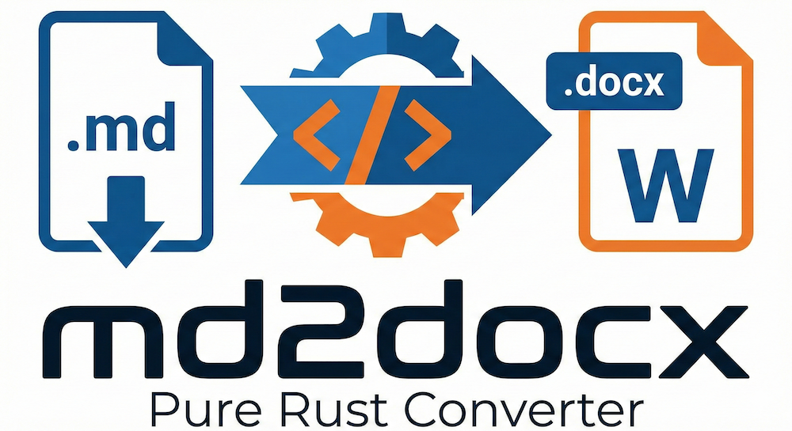

# md2docx



Markdown to professional DOCX converter with **native Thai language support**, built entirely in Rust.

## 🚀 Overview

`md2docx` is a high-performance command-line tool and Rust library that transforms your Markdown documents into standard Microsoft Word (DOCX) files. Unlike other tools, it is designed from the ground up to handle mixed Thai-English content perfectly.

### Key Features
- **Native Thai Support**: Automatic language detection and font switching (TH Sarabun New, etc.).
- **Pure Rust**: No external dependencies like Pandoc or Node.js required.
- **Rich Elements**: Supports Headings, Lists, Tables, Images, Mermaid Diagrams, TOC, and Page Numbers.
- **Fast & Cross-platform**: Native performance on Windows, macOS, and Linux.

---

## 🛠 Installation & Usage

### Option 1: Quick Install (macOS/Linux)
Install the latest version directly to `/usr/local/bin`:
```bash
curl -fsSL https://raw.githubusercontent.com/kapong/md2docx/main/install.sh | bash
```

### Option 2: Homebrew (macOS/Linux)
Install via our self-hosted tap:
```bash
brew tap kapong/md2docx https://github.com/kapong/md2docx
brew install md2docx
```

### Option 3: PowerShell (Windows)
Install the latest version with a single command:
```powershell
irm https://raw.githubusercontent.com/kapong/md2docx/main/install.ps1 | iex
```

### Option 4: Scoop (Windows)
Install via Scoop package manager:
```powershell
scoop bucket add md2docx https://github.com/kapong/md2docx
scoop install md2docx
```

### Option 5: Docker
Our Docker image is multi-platform (`amd64` and `arm64`), supporting both Intel and Apple Silicon Macs.

**Pull the image:**
```bash
docker pull ghcr.io/kapong/md2docx:latest
```

**Convert a document:**
```bash
docker run --rm \
  -v $(pwd):/workspace \
  ghcr.io/kapong/md2docx build -d docs/ -o output/manual.docx
```

### Basic Command Line Usage
```bash
# Build from a directory of markdown files
md2docx build -d docs/ -o output.docx
```


---

## ⚙️ Configuration

Create a `md2docx.toml` file alongside your Markdown files to customize output.

### Math Equations

```toml
[math]
renderer = "rex"       # "rex" (pure Rust, default) or "omml" (Word native)
font_size = "10pt"     # "8pt" to "12pt" (default: "10pt")
number_all = false     # true = number all display equations; false = only labeled ones
```

| Key | Default | Description |
|-----|---------|-------------|
| `renderer` | `"rex"` | `"rex"` renders LaTeX to SVG using a built-in math engine. `"omml"` converts to Word's native math XML. |
| `font_size` | `"10pt"` | Math font size. Supported: `8pt`, `9pt`, `10pt`, `11pt`, `12pt`. |
| `number_all` | `false` | When `true`, every display equation gets a sequential number `(1)`, `(2)`, … even without `\label`. When `false`, only equations with `\label{eq:...}` are numbered. |

**Equation labeling & cross-references:**

```markdown
$$
E = mc^2 \label{eq:einstein}
$$

As shown in Equation {ref:eq:einstein}, energy equals...
```

---

## 🤖 AI Should Read

If you are an AI agent working on this codebase:
- **Core Logic**: Located in `src/`. The project uses `pulldown-cmark` for parsing and `quick-xml` for direct OOXML generation.
- **Thai Handling**: Language segmentation and font switching logic is in `src/renderer/`.
- **Templates**: Custom DOCX templates are supported via `md2docx.toml` configuration.
- **Release CI**: GitHub Actions workflows in `.github/workflows/` handle multi-platform binary builds and Docker publishing.
- **Architecture**: It follows a Parser -> Intermediate Representation -> Builder flow.

---

## ✨ AI Disclaimer

This project is "vibing with AI". Coding, documentation, and architecture decisions were made with the assistance of **Opencode** and **Antigravity** (Google DeepMind). We embrace the future of agentic coding to build better tools, faster.

---
© 2026 Phongphan Phienphanich. Licensed under MIT.
