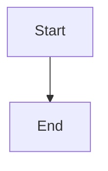
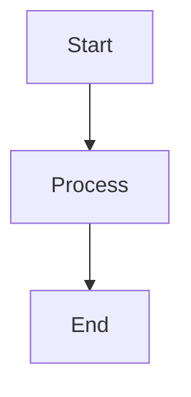

# Appendix A: Troubleshooting and FAQ {#ap01}

This chapter helps you solve common problems and answers frequently asked questions about md2docx.

บทนี้ช่วยคุณแก้ปัญหาที่พบบ่อยและตอบคำถามที่พบบ่อยเกี่ยวกับ md2docx

---

## Common Issues {#ap01-common-issues}

### Issue 1: Thai Text Displays Incorrectly / ข้อความภาษาไทยแสดงผลไม่ถูกต้อง

#### Symptom / อาการ

- Thai characters appear as boxes or question marks
- Thai text uses wrong font (not TH Sarabun New)
- Mixed Thai-English text has inconsistent fonts
- อักขระไทยปรากฏเป็นกล่องหรือเครื่องหมายคำถาม
- ข้อความภาษาไทยใช้ฟอนต์ผิด (ไม่ใช่ TH Sarabun New)
- ข้อความผสมภาษาไทย-อังกฤษมีฟอนต์ไม่สม่ำเสมอ

#### Cause / สาเหตุ

- Template doesn't have Thai font configured for complex script
- Font not installed on the system viewing the DOCX
- Missing `w:cs` (complex script) font attribute in styles
- แม่แบบไม่มีการกำหนดค่าฟอนต์ไทยสำหรับสคริปต์ที่ซับซ้อน
- ฟอนต์ไม่ได้ติดตั้งบนระบบที่ดู DOCX
- ขาดแอตทริบิวต์ฟอนต์ `w:cs` (complex script) ในสไตล์

#### Solution / วิธีแก้ไข

**Step 1:** Use Thai-optimized template:

```bash
md2docx dump-template -o thai-template.docx --lang th
```

**Step 2:** Verify font in template - Open template in Word, modify "Normal" style, check Latin font is Calibri and Complex script font is TH Sarabun New.

**Step 3:** Install Thai fonts:
- Windows: TH Sarabun New is pre-installed on Thai Windows
- macOS: Download from f0nt.com
- Linux: `sudo apt-get install fonts-thai-tlwg`

**Step 4:** Manual fix - Open output.docx in Word, select all (Ctrl+A), change font to TH Sarabun New, save.

---

### Issue 2: TOC Not Showing / สารบัญไม่แสดง

#### Symptom / อาการ

- Table of Contents page is blank or shows "No table of contents entries found"
- TOC heading appears but no entries below it
- หน้าสารบัญว่างเปล่าหรือแสดง "No table of contents entries found"
- หัวข้อสารบัญปรากฏแต่ไม่มีรายการด้านล่าง

#### Cause / สาเหตุ

- Headings don't have proper outline level set in styles
- TOC field codes not updated
- Headings use direct formatting instead of styles
- หัวข้อไม่มีระดับเค้าร่างที่ถูกต้องตั้งค่าในสไตล์
- รหัสฟิลด์ TOC ไม่ได้รับการอัปเดต
- หัวข้อใช้การจัดรูปแบบโดยตรงแทนสไตล์

#### Solution / วิธีแก้ไข

**Step 1:** Update TOC in Word - Right-click on TOC, select "Update Field", choose "Update entire table", click OK.

**Step 2:** Check heading styles - Verify `Heading1`, `Heading2`, etc. styles exist in template. Run: `md2docx validate-template your-template.docx`

**Step 3:** Regenerate with correct config:

```bash
md2docx build -d ./docs/ -o output.docx --toc --toc-depth 3
```

**Step 4:** Force TOC update via config:

```toml
[toc]
enabled = true
depth = 3
title = "Table of Contents"
```

---

### Issue 3: Page Numbers Not Appearing / หมายเลขหน้าไม่ปรากฏ

#### Symptom / อาการ

- Footer is empty, no page numbers visible
- Page numbers show as `{ PAGE }` instead of actual numbers
- Numbers appear on some pages but not others
- ส่วนท้ายว่างเปล่า ไม่เห็นหมายเลขหน้า
- หมายเลขหน้าแสดงเป็น `{ PAGE }` แทนตัวเลขจริง
- ตัวเลขปรากฏบนบางหน้าแต่ไม่ใช่ทั้งหมด

#### Cause / สาเหตุ

- Different first page header/footer enabled
- Page number field not inserted in footer
- Section breaks reset page numbering
- ส่วนหัว/ท้ายหน้าแรกที่แตกต่างกันเปิดใช้งาน
- ฟิลด์หมายเลขหน้าไม่ได้แทรกในส่วนท้าย
- ตัวแบ่งส่วนรีเซ็ตการนับหมายเลขหน้า

#### Solution / วิธีแก้ไข

**Step 1:** Update fields in Word - Select all (Ctrl+A), press F9 to update all fields. Or right-click in footer and select "Update Field".

**Step 2:** Check footer settings - Double-click footer area, ensure "Different First Page" is unchecked (unless intended), verify page number field is present.

**Step 3:** Regenerate with page numbers enabled:

```bash
md2docx build -d ./docs/ -o output.docx --page-numbers
```

**Step 4:** Manual insertion - Insert, Page Number, Bottom of Page, Plain Number.

---

### Issue 4: Images Not Displaying / รูปภาพไม่แสดง

#### Symptom / อาการ

- Red X or placeholder where image should be
- Image appears broken or corrupted
- Image size is wrong (too large/small)
- X สีแดงหรือตัวยึดตำแหน่งที่ควรเป็นรูปภาพ
- รูปภาพดูแตกหักหรือเสียหาย
- ขนาดรูปภาพผิด (ใหญ่/เล็กเกินไป)

#### Cause / สาเหตุ

- Image file not found at specified path
- Unsupported image format
- Image dimensions exceed page size
- Corrupted image file
- ไม่พบไฟล์รูปภาพที่พาธที่ระบุ
- รูปแบบรูปภาพไม่รองรับ
- ขนาดรูปภาพเกินขนาดหน้า
- ไฟล์รูปภาพเสียหาย

#### Solution / วิธีแก้ไข

**Step 1:** Verify image path - Check path is relative to markdown file location. Ensure image exists: `ls docs/assets/image.png`

**Step 2:** Check supported formats - PNG, JPEG, GIF, BMP are supported. SVG is converted to PNG. WebP and TIFF must be converted first.

**Step 3:** Fix image size in markdown:

```markdown
{width=50%}
{width=300px}
```

**Step 4:** Check image file:

```bash
file image.png
# Should show: PNG image data, 800 x 600, 8-bit/color RGBA
```

**Step 5:** Use absolute paths in config:

```toml
[images]
base_path = "/absolute/path/to/assets"
```

---

### Issue 5: Template Validation Fails / การตรวจสอบแม่แบบล้มเหลว

#### Symptom / อาการ

```
Template validation failed
Missing required styles:
  - Code
  - CodeChar
```

#### Cause / สาเหตุ

- Template created manually without required styles
- Template file is corrupted
- Using a regular DOCX instead of a template
- สร้างแม่แบบด้วยตนเองโดยไม่มีสไตล์ที่จำเป็น
- ไฟล์แม่แบบเสียหาย
- ใช้ DOCX ปกติแทนแม่แบบ

#### Solution / วิธีแก้ไข

**Step 1:** Generate proper template:

```bash
md2docx dump-template -o my-template.docx
```

**Step 2:** Customize the generated template - Open in Word, modify styles as needed, save (keep .docx extension).

**Step 3:** Validate again:

```bash
md2docx validate-template my-template.docx
```

**Step 4:** Check what's missing:

```bash
md2docx validate-template my-template.docx --verbose
```

---

### Issue 6: Output File Won't Open / ไฟล์เอาต์พุตเปิดไม่ได้

#### Symptom / อาการ

- Word shows "The file is corrupt and cannot be opened"
- Error: "Word found unreadable content"
- File opens but content is garbled
- Word แสดง "The file is corrupt and cannot be opened"
- ข้อผิดพลาด: "Word found unreadable content"
- ไฟล์เปิดได้แต่เนื้อหาคลำเคลื่อน

#### Cause / สาเหตุ

- Invalid XML generated (special characters not escaped)
- Duplicate relationship IDs
- Malformed OOXML structure
- Incomplete file write
- สร้าง XML ไม่ถูกต้อง (อักขระพิเศษไม่ได้ escape)
- ID ความสัมพันธ์ซ้ำกัน
- โครงสร้าง OOXML ผิดรูปแบบ
- การเขียนไฟล์ไม่สมบูรณ์

#### Solution / วิธีแก้ไข

**Step 1:** Try recovery in Word - File, Open, Select file, click arrow next to Open, select "Open and Repair".

**Step 2:** Check for special characters - Remove `<`, `>`, `&` from markdown (unless in code blocks). Use proper escaping: `&lt;`, `&gt;`, `&amp;`

**Step 3:** Regenerate without complex features:

```bash
md2docx build -i input.md -o output.docx --no-toc --no-page-numbers
```

**Step 4:** Check disk space:

```bash
df -h
```

**Step 5:** Report bug with sample markdown that causes the issue.

---

### Issue 7: Mermaid Diagrams Not Rendering / แผนผัง Mermaid ไม่เรนเดอร์

#### Symptom / อาการ

- Mermaid code block appears as plain text
- Placeholder image or broken image icon
- Error message about mermaid rendering
- บล็อกโค้ด Mermaid ปรากฏเป็นข้อความธรรมดา
- รูปภาพตัวยึดตำแหน่งหรือไอคอนรูปภาพเสีย
- ข้อความแสดงข้อผิดพลาดเกี่ยวกับการเรนเดอร์ mermaid

#### Cause / สาเหตุ

- Mermaid feature not enabled
- Invalid mermaid syntax
- Rendering timeout or failure
- Cache corruption
- ฟีเจอร์ Mermaid ไม่ได้เปิดใช้งาน
- ไวยากรณ์ mermaid ไม่ถูกต้อง
- หมดเวลาหรือการเรนเดอร์ล้มเหลว
- แคชเสียหาย

#### Solution / วิธีแก้ไข

**Step 1:** Enable mermaid in config:

```toml
[mermaid]
enabled = true
theme = "default"
```

**Step 2:** Verify mermaid syntax:

```markdown


**Step 3:** Clear cache:

```bash
rm -rf .md2docx-cache/mermaid/
```

**Step 4:** Test with simple diagram:

```markdown


**Step 5:** Check for Thai text (known limitation) - Thai characters in mermaid diagrams currently fail. Use English labels only for now.

---

### Issue 8: List Numbering Issues / ปัญหาการนับลำดับรายการ

#### Symptom / อาการ

- Lists continue numbering when they should restart
- Two separate lists share the same numbering
- List interrupted by code block starts at 1 instead of continuing
- รายการนับลำดับต่อเมื่อควรเริ่มใหม่
- รายการสองรายการแยกกันใช้การนับลำดับเดียวกัน
- รายการที่ถูกขัดจังหวะโดยบล็อกโค้ดเริ่มที่ 1 แทนที่จะนับต่อ

#### Cause / สาเหตุ

- Lists share the same abstract numbering definition
- No explicit restart directive in OOXML
- Code block between list items breaks list continuity
- รายการใช้คำนิยามการนับลำดับนามธรรมเดียวกัน
- ไม่มีคำสั่งรีสตาร์ทที่ชัดเจนใน OOXML
- บล็อกโค้ดระหว่างรายการทำลายความต่อเนื่องของรายการ

#### Solution / วิธีแก้ไข

**Step 1:** This is now handled automatically in recent versions.

**Step 2:** If issue persists, force new list:

```markdown
1. First item
2. Second item

<!-- Force break -->

1. New list starts at 1
2. Second item
```

**Step 3:** For continued lists after code blocks:

```markdown
1. Item one
2. Item two

   ```rust
   // Some code
   ```

3. Item three (continues)
4. Item four
```

---

## Error Messages {#ap01-error-messages}

### Common Errors / ข้อผิดพลาดทั่วไป

| Error Message | Meaning | Solution |
|---------------|---------|----------|
| `Failed to parse markdown: ...` | Invalid markdown syntax | Check markdown for syntax errors |
| `Template error: Missing style 'Code'` | Template missing required style | Regenerate template with `dump-template` |
| `IO error: No such file or directory` | Input file not found | Verify file path exists |
| `Config error: Invalid TOML` | Config file syntax error | Validate TOML syntax |
| `Mermaid error: ...` | Diagram rendering failed | Check mermaid syntax, clear cache |
| `Not implemented: ...` | Feature not yet available | Check documentation for alternatives |

### Exit Codes / รหัสออก

| Code | Meaning | Action |
|------|---------|--------|
| 0 | Success | None needed |
| 1 | General error | Check error message |
| 2 | Invalid input | Verify command arguments |
| 3 | File not found | Check file paths |
| 4 | Parse error | Fix markdown syntax |
| 5 | Template error | Validate/rebuild template |
| 6 | IO error | Check permissions/disk space |
| 7 | Config error | Fix config file syntax |

---

## FAQ {#ap01-faq}

### General Questions / คำถามทั่วไป

#### Q: Is md2docx free to use? / md2docx ใช้ฟรีหรือไม่?

**A:** Yes, md2docx is open source under the MIT license. You can use it for free in personal and commercial projects.

ใช่ md2docx เป็นโอเพนซอร์สภายใต้สัญญาอนุญาต MIT คุณสามารถใช้ได้ฟรีในโครงการส่วนบุคคลและเชิงพาณิชย์

#### Q: What languages are supported? / รองรับภาษาอะไรบ้าง?

**A:** md2docx supports any Unicode text. It has special handling for English (default), Thai (optimized fonts, line breaking), and other languages work but may need custom templates.

md2docx รองรับข้อความ Unicode ใดๆ มีการจัดการพิเศษสำหรับอังกฤษ (ค่าเริ่มต้น) ไทย (ฟอนต์ที่ปรับให้เหมาะสม การตัดบรรทัด) และภาษาอื่นทำงานได้แต่อาจต้องการแม่แบบกำหนดเอง

#### Q: What operating systems are supported? / รองรับระบบปฏิบัติการอะไรบ้าง?

**A:** Linux (x64, ARM64), macOS (Intel, Apple Silicon), Windows (x64), and WebAssembly (WIP).

---

### Usage Questions / คำถามการใช้งาน

#### Q: Can I convert multiple markdown files? / แปลงไฟล์ markdown หลายไฟล์ได้หรือไม่?

**A:** Yes, use the directory mode:

```bash
md2docx build -d ./docs/ -o output.docx
```

Files are processed in order: `cover.md`, `ch01_*.md`, `ch02_*.md`, etc.

ใช่ ใช้โหมดไดเรกทอรี ไฟล์จะประมวลผลตามลำดับ: `cover.md`, `ch01_*.md`, `ch02_*.md`, ฯลฯ

#### Q: Can I use my own Word template? / ใช้แม่แบบ Word ของตัวเองได้หรือไม่?

**A:** Yes! Generate a base template, customize it in Word, then use it:

```bash
md2docx dump-template -o my-template.docx
# Edit in Word...
md2docx build -i input.md -o output.docx --template my-template.docx
```

ใช่! สร้างแม่แบบฐาน ปรับแต่งใน Word จากนั้นใช้งาน

#### Q: How do I add a cover page? / เพิ่มหน้าปกอย่างไร?

**A:** Create a `cover.md` file in your docs directory:

```markdown
# My Document Title

## Subtitle

**Author:** John Doe
**Date:** January 2025
```

Or use a `cover.docx` template with placeholders.

สร้างไฟล์ `cover.md` ในไดเรกทอรีเอกสาร หรือใช้แม่แบบ `cover.docx` พร้อมตัวยึดตำแหน่ง

---

### Feature Questions / คำถามฟีเจอร์

#### Q: Does it support Mermaid diagrams? / รองรับแผนผัง Mermaid หรือไม่?

**A:** Yes! Use mermaid code blocks. Note: Thai text in diagrams currently has issues (upstream bug).

```markdown


ใช่! ใช้บล็อกโค้ด mermaid หมายเหตุ: ข้อความภาษาไทยในแผนผังมีปัญหาในขณะนี้

#### Q: Is there syntax highlighting for code? / มีการไฮไลต์ไวยากรณ์สำหรับโค้ดหรือไม่?

**A:** Code blocks use monospace font. Full syntax highlighting (colors) is not yet implemented but planned.

บล็อกโค้ดใช้ฟอนต์ monospace การไฮไลต์ไวยากรณ์แบบเต็ม (สี) ยังไม่ได้รับการพัฒนาแต่วางแผนไว้

#### Q: Can I include content from other files? / รวมเนื้อหาจากไฟล์อื่นได้หรือไม่?

**A:** Yes, use include directives:

```markdown
{!include:path/to/section.md}
{!code:src/main.rs:10-25}
```

ใช่ ใช้คำสั่ง include

---

### Performance Questions / คำถามประสิทธิภาพ

#### Q: How fast is the conversion? / การแปลงเร็วแค่ไหน?

**A:** Typical performance: Small file (< 100 KB) takes less than 1 second, medium project (10 chapters) takes 2-5 seconds, large project (100+ pages) takes 10-30 seconds, and mermaid diagrams add 1-3 seconds per diagram.

ประสิทธิภาพโดยทั่วไป: ไฟล์เล็กใช้เวลาน้อยกว่า 1 วินาที โครงการขนาดกลางใช้ 2-5 วินาที โครงการขนาดใหญ่ใช้ 10-30 วินาที และแผนผัง mermaid เพิ่ม 1-3 วินาทีต่อแผนผัง

#### Q: How much memory does it use? / ใช้หน่อความจำเท่าไร?

**A:** Memory usage scales with document size: Small documents use ~10-20 MB, large documents use ~50-100 MB, with peak usage during image processing.

การใช้หน่อความจำปรับตามขนาดเอกสาร: เอกสารขนาดเล็กใช้ ~10-20 MB เอกสารขนาดใหญ่ใช้ ~50-100 MB การใช้งานสูงสุดระหว่างการประมวลผลรูปภาพ

#### Q: Can it handle very large documents? / จัดการเอกสารขนาดใหญ่มากได้หรือไม่?

**A:** Yes, tested with documents up to 500+ pages. For best results: split into chapters, use draft mode for previews, and optimize images before including.

ใช่ ทดสอบกับเอกสารมากกว่า 500 หน้า สำหรับผลลัพธ์ที่ดีที่สุด: แบ่งเป็นบท ใช้โหมดร่างสำหรับตัวอย่าง และปรับรูปภาพให้เหมาะสมก่อนรวม

---

## Getting Help {#ap01-getting-help}

### GitHub Issues / ปัญหา GitHub

Report bugs and request features on GitHub.

รายงานข้อบกพร่องและขอฟีเจอร์บน GitHub

**Repository:** `https://github.com/pongpanich/md2docx`

### What to Include When Reporting Bugs / ข้อมูลที่ควรรวมเมื่อรายงานข้อบกพร่อง

When reporting bugs, include: md2docx version (`md2docx --version`), operating system, minimal reproduction case (small markdown file that triggers the issue, command used, expected vs actual output), error messages (full error output, exit code), and template file if applicable.

### Example Bug Report / ตัวอย่างรายงานข้อบกพร่อง

```markdown
**Version:** md2docx 0.1.3
**OS:** macOS 14.2

**Command:**
md2docx build -i test.md -o test.docx --template my.docx

**Input (test.md):**
# Test
สวัสดี

**Expected:** Thai text displays correctly
**Actual:** Thai text shows as boxes

**Template:** Generated with `dump-template --lang th`
```

---

## Known Limitations {#ap01-known-limitations}

### Current Limitations / ข้อจำกัดปัจจุบัน

| Limitation | Status | Workaround |
|------------|--------|------------|
| Thai text in Mermaid diagrams | Bug | Use English labels only |
| Template style application | Partial | Shows warning; styles not fully applied |
| WASM bindings | Not implemented | Use CLI version |
| Watch mode | Not implemented | Use external file watcher |
| Bibliography/citations | Not implemented | Manual formatting |
| Index generation | Not implemented | Manual creation |
| Syntax highlighting | Not implemented | Monospace only |
| PDF output | Not implemented | Convert DOCX to PDF in Word |

### Thai in Mermaid Diagrams / ภาษาไทยในแผนผัง Mermaid

**Issue:** Mermaid diagrams containing Thai text fail to render.

**Cause:** Upstream bug in mermaid-rs-renderer crate.

**Workaround:** Use English labels in diagrams:

```markdown


### Template Style Application / การใช้สไตล์แม่แบบ

**Issue:** Using `--template` shows warning: "Template support is not yet implemented"

**Status:** Template validation works, but style extraction/application is incomplete.

**Workaround:** Generate document without template, open in Word, apply styles manually or attach template.

### WASM Not Fully Implemented / WASM ยังไม่ได้รับการพัฒนาเต็มรูปแบบ

**Issue:** WASM bindings are stubs only.

**Status:** Planned for future release.

**Workaround:** Use CLI version or compile to native binary.

### Watch Mode Not Implemented / โหมด Watch ยังไม่ได้รับการพัฒนา

**Issue:** `--watch` flag exists but not functional.

**Workaround:** Use external tools:

```bash
# Using entr
find docs/ -name '*.md' | entr -r md2docx build -d ./docs/ -o output.docx

# Using watchexec
watchexec -w docs/ "md2docx build -d ./docs/ -o output.docx"
```

### Bibliography/Citations Not Implemented / บรรณานุกรม/การอ้างอิงยังไม่ได้รับการพัฒนา

**Issue:** `[@cite-key]` syntax is parsed but not processed.

**Status:** Planned for future release.

**Workaround:** Format citations manually:

```markdown
## References

1. Smith, J. (2024). *Title of Book*. Publisher.
2. Doe, A. (2023). "Article Title". Journal Name.
```

### Index Generation Not Implemented / การสร้างดัชนียังไม่ได้รับการพัฒนา

**Issue:** `{index:term}` markers are parsed but not processed.

**Status:** Planned for future release.

**Workaround:** Create index manually after generating DOCX.

---

## Quick Fixes / การแก้ไขด่วน

### Reset Everything / รีเซ็ตทั้งหมด

```bash
# Clear cache
rm -rf .md2docx-cache/

# Regenerate template
md2docx dump-template -o fresh-template.docx

# Build with minimal options
md2docx build -i input.md -o output.docx --no-toc --no-page-numbers
```

### Debug Build / สร้างดีบัก

```bash
# Verbose output
md2docx -v build -d ./docs/ -o output.docx

# Validate template first
md2docx validate-template template.docx --verbose
```

### Check Installation / ตรวจสอบการติดตั้ง

```bash
# Version
md2docx --version

# Help
md2docx --help
md2docx build --help

# Test conversion
echo "# Test" | md2docx build -i /dev/stdin -o test.docx
```
