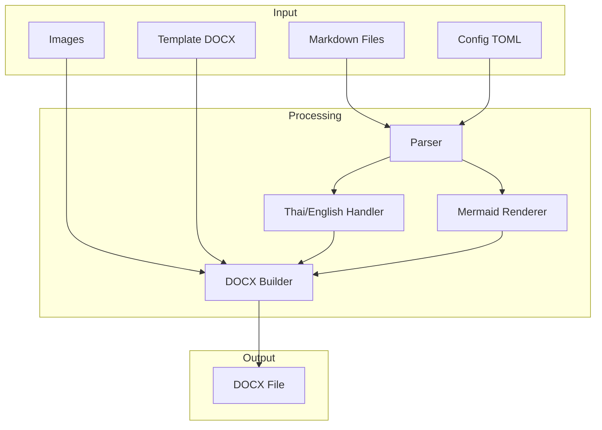

# Chapter 1: Introduction / บทที่ 1: บทนำ {#ch01}

## What is md2docx? / md2docx คืออะไร?

md2docx is a command-line tool and Rust library for converting Markdown documents into professional Microsoft Word (DOCX) files.

md2docx เป็นเครื่องมือ command-line และไลบรารี Rust สำหรับแปลงเอกสาร Markdown เป็นไฟล์ Microsoft Word (DOCX) ระดับมืออาชีพ

## Key Features / คุณสมบัติหลัก

### Full Thai Language Support / รองรับภาษาไทยอย่างสมบูรณ์

md2docx is designed with Thai language support from the ground up:

md2docx ถูกออกแบบให้รองรับภาษาไทยตั้งแต่แรก:

- **Automatic language detection** - Detects Thai and English text for proper font switching
- **Thai fonts** - Supports TH Sarabun New, Angsana New, and other Thai fonts
- **Proper rendering** - Correct display of mixed Thai-English content
- **ตรวจจับภาษาอัตโนมัติ** - ตรวจจับข้อความภาษาไทยและอังกฤษเพื่อสลับฟอนต์ที่เหมาะสม
- **ฟอนต์ไทย** - รองรับ TH Sarabun New, Angsana New และฟอนต์ไทยอื่นๆ
- **แสดงผลถูกต้อง** - แสดงผลเนื้อหาผสมไทย-อังกฤษได้ถูกต้อง

### Standard DOCX Output / ผลลัพธ์ DOCX มาตรฐาน

md2docx creates standard Office Open XML (OOXML) documents:

md2docx สร้างเอกสารมาตรฐาน Office Open XML (OOXML):

- Opens in Microsoft Word 2007 and later
- Compatible with LibreOffice, Google Docs, and Pages
- Preserves all formatting in the file
- Uses efficient ZIP compression
- เปิดได้ใน Microsoft Word 2007 ขึ้นไป
- ใช้งานได้กับ LibreOffice, Google Docs และ Pages
- รักษารูปแบบทั้งหมดไว้ในไฟล์
- ใช้การบีบอัด ZIP ที่มีประสิทธิภาพ

### Rich Document Features / ฟีเจอร์เอกสารครบถ้วน

| Feature / ฟีเจอร์ | Status / สถานะ |
|------------------|----------------|
| Headings / หัวข้อ | ✅ |
| Lists / รายการ | ✅ |
| Tables / ตาราง | ✅ |
| Images / รูปภาพ | ✅ |
| Code blocks / บล็อกโค้ด | ✅ |
| Mermaid diagrams | ✅ |
| Table of Contents / สารบัญ | ✅ |
| Page numbers / หมายเลขหน้า | ✅ |
| Cross-references / การอ้างอิงข้าม | ✅ |
| Footnotes / เชิงอรรถ | ✅ |
| Custom templates / แม่แบบกำหนดเอง | ✅ |

## Why md2docx? / ทำไมต้อง md2docx?

### Problems with Existing Solutions / ปัญหาของวิธีแก้ปัญหาที่มีอยู่

If you've tried converting Markdown to DOCX before, you may have encountered these issues:

หากคุณเคยลองแปลง Markdown เป็น DOCX มาก่อน คุณอาจเจอปัญหาเหล่านี้:

| Problem / ปัญหา | Traditional Solution / วิธีแก้แบบเดิม | md2docx Solution / วิธีแก้ด้วย md2docx |
|-----------------|--------------------------------------|---------------------------------------|
| Thai text displays incorrectly / ภาษาไทยแสดงผลผิด | Manual font adjustment / ปรับฟอนต์ด้วยมือ | Automatic font handling / จัดการฟอนต์อัตโนมัติ |
| Inconsistent formatting / รูปแบบไม่สม่ำเสมอ | Edit each file in Word / แก้ไขทีละไฟล์ใน Word | Template-based consistency / ใช้แม่แบบให้สม่ำเสมอ |
| Manual TOC creation / สร้างสารบัญด้วยมือ | Time-consuming manual work / ทำด้วยมือใช้เวลานาน | Automatic generation / สร้างอัตโนมัติ |
| Ugly code blocks / บล็อกโค้ดไม่สวย | Manual formatting / จัดรูปแบบเอง | Syntax highlighting ready / พร้อม syntax highlighting |
| Multiple files to merge / หลายไฟล์ต้องรวม | Copy-paste / Copy-paste ทีละไฟล์ | Automatic chapter merging / รวมบทอัตโนมัติ |

### Pure Rust Implementation / พัฒนาด้วย Rust ล้วน

md2docx is written entirely in Rust, providing:

md2docx เขียนด้วย Rust ทั้งหมด ให้ประโยชน์:

- **No external dependencies** - No need to install Pandoc, Node.js, or other tools
- **Cross-platform** - Works on Windows, macOS, and Linux
- **Fast** - Native performance, processes large documents quickly
- **Safe** - Memory safety guaranteed by Rust
- **WASM support** - Can run in browsers (planned)
- **ไม่ต้องพึ่งพาเครื่องมือภายนอก** - ไม่ต้องติดตั้ง Pandoc, Node.js หรือเครื่องมืออื่น
- **ข้ามแพลตฟอร์ม** - ทำงานได้บน Windows, macOS และ Linux
- **เร็ว** - ประสิทธิภาพ native ประมวลผลเอกสารขนาดใหญ่ได้รวดเร็ว
- **ปลอดภัย** - ความปลอดภัยของหน่วยความจำรับประกันโดย Rust
- **รองรับ WASM** - สามารถรันในเบราว์เซอร์ได้ (อยู่ในแผน)

## System Architecture / สถาปัตยกรรมระบบ

## Next Steps / ขั้นตอนถัดไป

Now that you understand what md2docx is, continue to the next chapters:

ตอนนี้คุณเข้าใจแล้วว่า md2docx คืออะไร ดำเนินต่อไปยังบทถัดไป:

- **Chapter 2: Installation** - How to install md2docx on your system
- **บทที่ 2: การติดตั้ง** - วิธีติดตั้ง md2docx บนระบบของคุณ
- **Chapter 3: Quick Start** - Create your first document in 5 minutes
- **บทที่ 3: เริ่มต้นอย่างรวดเร็ว** - สร้างเอกสารแรกใน 5 นาที
