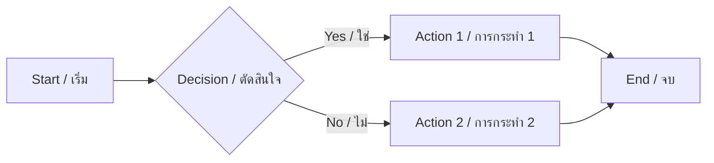

# Chapter 4: Markdown Syntax Reference / บทที่ 4: คู่มือไวยากรณ์ Markdown {#ch04}

A complete guide to all Markdown syntax supported by md2docx.

คู่มือครบถ้วนเกี่ยวกับไวยากรณ์ Markdown ที่รองรับโดย md2docx

## Headings / หัวข้อ

Use `#` for headings. One `#` is the largest, six `######` is the smallest.

ใช้ `#` สำหรับหัวข้อ หนึ่ง `#` คือใหญ่ที่สุด หก `######` คือเล็กที่สุด

```markdown
# Heading 1 / หัวข้อ 1
## Heading 2 / หัวข้อ 2
### Heading 3 / หัวข้อ 3
#### Heading 4 / หัวข้อ 4
##### Heading 5 / หัวข้อ 5
###### Heading 6 / หัวข้อ 6
```

## Paragraphs / ย่อหน้า

Just write text with a blank line between paragraphs.

เขียนข้อความโดยเว้นบรรทัดว่างระหว่างย่อหน้า

```markdown
This is the first paragraph. It can contain multiple sentences.

นี่คือย่อหน้าแรก สามารถมีหลายประโยคได้

This is the second paragraph. Note the blank line above.

นี่คือย่อหน้าที่สอง สังเกตบรรทัดว่างด้านบน
```

## Text Formatting / การจัดรูปแบบข้อความ

### Bold / ตัวหนา

```markdown
**This text is bold** / **ข้อความนี้เป็นตัวหนา**
__This is also bold__ / __อันนี้ก็หนาเหมือนกัน__
```

**This text is bold** / **ข้อความนี้เป็นตัวหนา**

### Italic / ตัวเอียง

```markdown
*This text is italic* / *ข้อความนี้เป็นตัวเอียง*
_This is also italic_ / _อันนี้ก็เอียงเหมือนกัน_
```

*This text is italic* / *ข้อความนี้เป็นตัวเอียง*

### Bold and Italic / ตัวหนาและเอียง

```markdown
***Bold and italic*** / ***หนาและเอียง***
**_Also works_** / **_ก็ได้เหมือนกัน_**
```

***Bold and italic*** / ***หนาและเอียง***

### Strikethrough / ขีดฆ่า

```markdown
~~This text is deleted~~ / ~~ข้อความนี้ถูกลบ~~
```

~~This text is deleted~~ / ~~ข้อความนี้ถูกลบ~~

### Inline Code / โค้ดในแถว

```markdown
Use `println!()` for output / ใช้ `println!()` สำหรับแสดงผล
```

Use `println!()` for output / ใช้ `println!()` สำหรับแสดงผล

## Lists / รายการ

### Unordered Lists / รายการไม่มีลำดับ

```markdown
- First item / รายการแรก
- Second item / รายการที่สอง
- Third item / รายการที่สาม
  - Nested item / รายการย่อย
  - Another nested / รายการย่อยอีกอัน
```

- First item / รายการแรก
- Second item / รายการที่สอง
- Third item / รายการที่สาม
  - Nested item / รายการย่อย
  - Another nested / รายการย่อยอีกอัน

### Ordered Lists / รายการมีลำดับ

```markdown
1. First step / ขั้นตอนที่ 1
2. Second step / ขั้นตอนที่ 2
3. Third step / ขั้นตอนที่ 3
   1. Sub-step / ขั้นตอนย่อย
   2. Another sub-step / ขั้นตอนย่อยอีกอัน
```

1. First step / ขั้นตอนที่ 1
2. Second step / ขั้นตอนที่ 2
3. Third step / ขั้นตอนที่ 3
   1. Sub-step / ขั้นตอนย่อย
   2. Another sub-step / ขั้นตอนย่อยอีกอัน

### Task Lists / รายการงาน

```markdown
- [x] Completed task / งานที่เสร็จแล้ว
- [ ] Pending task / งานที่รอดำเนินการ
- [ ] Another pending / งานรออีกอัน
```

- [x] Completed task / งานที่เสร็จแล้ว
- [ ] Pending task / งานที่รอดำเนินการ
- [ ] Another pending / งานรออีกอัน

## Links / ลิงก์

### Inline Links / ลิงก์แบบ Inline

```markdown
Visit [md2docx website](https://github.com/pong/md2docx) for more info.
เยี่ยมชม [เว็บไซต์ md2docx](https://github.com/pong/md2docx) สำหรับข้อมูลเพิ่มเติม
```

Visit [md2docx website](https://github.com/pong/md2docx) for more info.
เยี่ยมชม [เว็บไซต์ md2docx](https://github.com/pong/md2docx) สำหรับข้อมูลเพิ่มเติม

### Reference Links / ลิงก์แบบ Reference

```markdown
Check out [Rust][rust-lang] and [Cargo][cargo-docs].

[rust-lang]: https://www.rust-lang.org
[cargo-docs]: https://doc.rust-lang.org/cargo/
```

Check out [Rust][rust-lang] and [Cargo][cargo-docs].

[rust-lang]: https://www.rust-lang.org
[cargo-docs]: https://doc.rust-lang.org/cargo/

## Images / รูปภาพ

### Basic Image / รูปภาพพื้นฐาน

```markdown

```

### Image with Width / รูปภาพพร้อมความกว้าง

```markdown
{width=80%}
{width=100px}
```

## Tables / ตาราง

### Basic Table / ตารางพื้นฐาน

```markdown
| Name / ชื่อ | Email / อีเมล | Role / บทบาท |
|-------------|--------------|-------------|
| John | john@example.com | Admin |
| Jane | jane@example.com | User |
| สมชาย | somchai@example.com | ผู้ดูแล |
```

| Name / ชื่อ | Email / อีเมล | Role / บทบาท |
|-------------|--------------|-------------|
| John | john@example.com | Admin |
| Jane | jane@example.com | User |
| สมชาย | somchai@example.com | ผู้ดูแล |

### Aligned Table / ตารางจัดตำแหน่ง

```markdown
| Left / ซ้าย | Center / กลาง | Right / ขวา |
|:-----------|:------------:|------------:|
| L1 | C1 | R1 |
| L2 | C2 | R2 |
```

| Left / ซ้าย | Center / กลาง | Right / ขวา |
|:-----------|:------------:|------------:|
| L1 | C1 | R1 |
| L2 | C2 | R2 |

## Code Blocks / บล็อกโค้ด

### Basic Code Block / บล็อกโค้ดพื้นฐาน

```markdown
```rust
fn main() {
    println!("Hello, World!");
    println!("สวัสดีชาวโลก!");
}
```
```

```rust
fn main() {
    println!("Hello, World!");
    println!("สวัสดีชาวโลก!");
}
```

### Code Block with Filename / บล็อกโค้ดพร้อมชื่อไฟล์

```markdown
```python,filename=hello.py
print("Hello, World!")
print("สวัสดีชาวโลก!")
```
```

### Code Block with Line Numbers / บล็อกโค้ดพร้อมหมายเลขบรรทัด

```markdown
```rust,linenos
fn main() {
    let name = "World";
    println!("Hello, {}!", name);
}
```
```

### Code Block with Line Highlighting / บล็อกโค้ดพร้อมไฮไลท์บรรทัด

```markdown
```python,hl=2,4-5
def greet(name):
    print(f"Hello, {name}!")  # Highlighted
    print("Welcome")
    print("To our app")       # Highlighted
    print("Enjoy!")           # Highlighted
```
```

## Blockquotes / ข้อความอ้างอิง

### Basic Blockquote / ข้อความอ้างอิงพื้นฐาน

```markdown
> This is a blockquote. / นี่คือข้อความอ้างอิง
> It can span multiple lines. / สามารถขึ้นบรรทัดใหม่ได้
```

> This is a blockquote. / นี่คือข้อความอ้างอิง
> It can span multiple lines. / สามารถขึ้นบรรทัดใหม่ได้

### Nested Blockquotes / ข้อความอ้างอิงซ้อน

```markdown
> First level / ระดับแรก
>> Second level / ระดับสอง
>>> Third level / ระดับสาม
```

> First level / ระดับแรก
>> Second level / ระดับสอง
>>> Third level / ระดับสาม

### Blockquote with Other Elements / ข้อความอ้างอิงกับองค์ประกอบอื่น

```markdown
> **Note:** Important information here.
> **หมายเหตุ:** ข้อมูลสำคัญอยู่ที่นี่
>
> - Item 1 / รายการ 1
> - Item 2 / รายการ 2
```

> **Note:** Important information here.
> **หมายเหตุ:** ข้อมูลสำคัญอยู่ที่นี่
>
> - Item 1 / รายการ 1
> - Item 2 / รายการ 2

## Horizontal Rules / เส้นแบ่ง

Use three or more dashes, asterisks, or underscores.

ใช้ขีดกลาง ดอกจัน หรือขีดล่าง สามตัวขึ้นไป

```markdown
---

***

___
```

---

## Footnotes / เชิงอรรถ

```markdown
This sentence has a footnote[^1].
ประโยคนี้มีเชิงอรรถ[^2]

[^1]: This is the footnote content.
[^2]: นี่คือเนื้อหาของเชิงอรรถ
```

This sentence has a footnote[^1].
ประโยคนี้มีเชิงอรรถ[^2]

[^1]: This is the footnote content.
[^2]: นี่คือเนื้อหาของเชิงอรรถ

## Frontmatter / ข้อมูลส่วนหัว

Add YAML frontmatter at the beginning of your file:

เพิ่ม YAML frontmatter ที่ต้นไฟล์:

```markdown
---
title: "Chapter Title / ชื่อบท"
author: "Your Name / ชื่อคุณ"
date: "2024-01-15"
skip_toc: false
language: th
---

# Chapter Content / เนื้อหาบท
```

## Mermaid Diagrams / แผนภาพ Mermaid

Create diagrams using Mermaid syntax:

สร้างแผนภาพโดยใช้ไวยากรณ์ Mermaid:

```markdown

```

## Summary / สรุป

md2docx supports all common Markdown syntax plus extensions:

md2docx รองรับไวยากรณ์ Markdown ทั่วไปทั้งหมด บวกกับส่วนขยาย:

| Feature / ฟีเจอร์ | Syntax / ไวยากรณ์ |
|-------------------|-------------------|
| Headings / หัวข้อ | `#` to `######` |
| Bold / หนา | `**text**` |
| Italic / เอียง | `*text*` |
| Code / โค้ด | `` `code` `` |
| Lists / รายการ | `-` or `1.` |
| Links / ลิงก์ | `[text](url)` |
| Images / รูป | `` |
| Tables / ตาราง | `\| col \| col \|` |
| Blockquotes / อ้างอิง | `> text` |
| Footnotes / เชิงอรรถ | `[^1]` |
| Mermaid / แผนภาพ | `mermaid` code block |

For more examples, see the example projects in the repository.

สำหรับตัวอย่างเพิ่มเติม ดูที่โปรเจกต์ตัวอย่างใน repository
