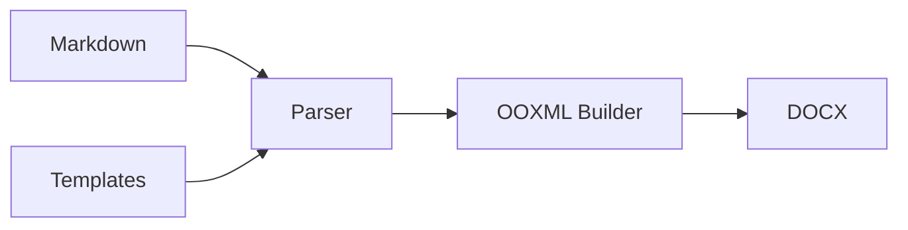

A Rust-based tool for converting Markdown documentation to professional Microsoft Word documents with full Thai language support.

```mermaid
flowchart LR
    MD[Markdown] --> Parser
    Templates[Templates] --> Parser
    Parser --> Builder[OOXML Builder]
    Builder --> DOCX[DOCX]
```

---

**https://github.com/kapong/md2docx**

