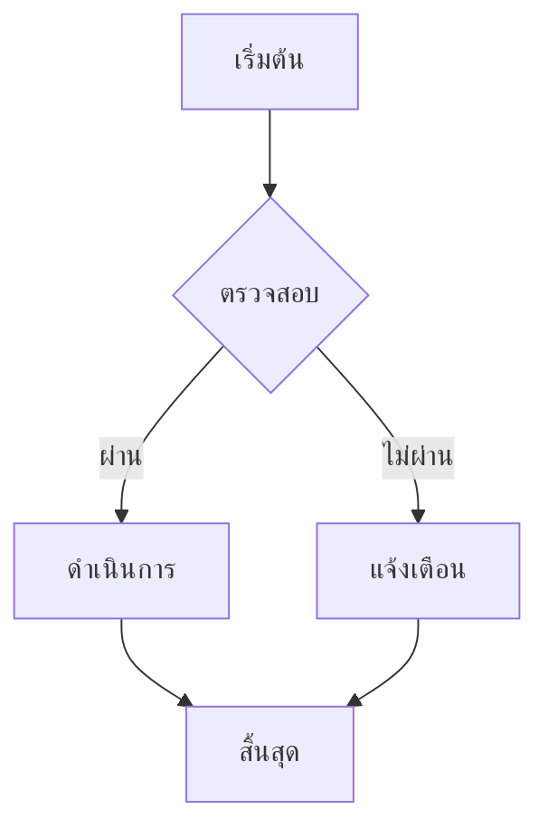
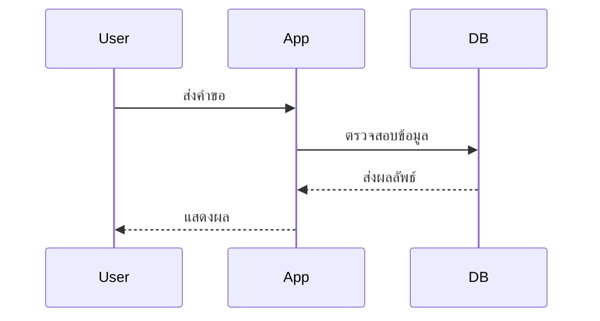
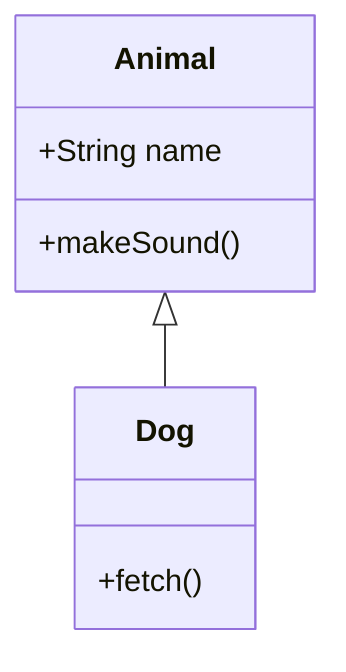

# บทที่ 4 การใช้งานขั้นสูง {#ch04}

บทนี้จะอธิบายการใช้งาน md2docx ในระดับขั้นสูง รวมถึงการสร้าง Template เอง การใช้งานผ่าน CLI การใช้งานเป็น Library และการแก้ไขปัญหาที่พบบ่อย

## การสร้าง Template เอง

Template คือไฟล์ DOCX ที่กำหนดรูปแบบเอกสารทั้งหมด รวมถึง Styles, Fonts, Colors และรูปแบบอื่นๆ

### ขั้นตอนการสร้าง Template

#### ขั้นตอนที่ 1: สร้าง Template เริ่มต้น

ใช้คำสั่ง `dump-template` เพื่อสร้าง Template เริ่มต้น:

```bash
# สร้าง Template ภาษาไทย
md2docx dump-template -o custom-reference.docx --lang th

# สร้าง Template ภาษาอังกฤษ
md2docx dump-template -o custom-reference.docx --lang en

# สร้าง Template แบบ minimal (Styles น้อยลง)
md2docx dump-template -o minimal.docx --minimal
```

#### ขั้นตอนที่ 2: เปิด Template ใน Microsoft Word

เปิดไฟล์ `custom-reference.docx` ใน Microsoft Word

#### ขั้นตอนที่ 3: ปรับแต่ง Styles

1. ไปที่แท็บ **Home**
2. คลิกที่ปุ่ม **Styles** (มุมขวาบนของ ribbon)
3. เลือก Style ที่ต้องการแก้ไข
4. คลิกขวา → **Modify**
5. ปรับแต่งตามต้องการ:
   - **Font** - เลือกฟอนต์ ขนาด สี
   - **Paragraph** - การจัดแนว ระยะห่าง
   - **Borders** - เส้นขอบ
   - **Shading** - สีพื้นหลัง

#### ขั้นตอนที่ 4: บันทึก Template

บันทึกไฟล์เป็นชื่อใหม่ เช่น `my-template.docx`

### Styles ที่จำเป็น

md2docx ต้องการ Styles ต่อไปนี้ใน Template:

| Style ID | ประเภท | ใช้สำหรับ |
|----------|--------|------------|
| `Title` | Paragraph | ชื่อเอกสารบนหน้าปก |
| `Subtitle` | Paragraph | ชื่อรองบนหน้าปก |
| `Heading1` | Paragraph | หัวข้อระดับ 1 (`#`) |
| `Heading2` | Paragraph | หัวข้อระดับ 2 (`##`) |
| `Heading3` | Paragraph | หัวข้อระดับ 3 (`###`) |
| `Heading4` | Paragraph | หัวข้อระดับ 4 (`####`) |
| `Normal` | Paragraph | ย่อหน้าปกติ |
| `Code` | Paragraph | Code blocks |
| `CodeChar` | Character | Inline code |
| `Quote` | Paragraph | Blockquotes |
| `Caption` | Paragraph | Caption รูปภาพ/ตาราง |
| `TOC1` | Paragraph | สารบัญระดับ 1 |
| `TOC2` | Paragraph | สารบัญระดับ 2 |
| `TOC3` | Paragraph | สารบัญระดับ 3 |
| `Hyperlink` | Character | ลิงก์ |

### การปรับแต่ง Styles แต่ละประเภท

#### ปรับแต่ง Heading Styles

1. เปิดไฟล์ Template
2. ไปที่ Styles panel
3. คลิกขวาที่ `Heading1` → **Modify**
4. ปรับแต่ง:
   - **Font:** TH Sarabun New, 20pt, Bold
   - **Color:** Blue (หรือสีที่ต้องการ)
   - **Spacing:** Before 24pt, After 6pt
5. ติ๊ก **Automatically update**
6. คลิก **OK**

ทำซ้ำสำหรับ `Heading2`, `Heading3`, `Heading4`

#### ปรับแต่ง Code Styles

1. คลิกขวาที่ `Code` → **Modify**
2. ปรับแต่ง:
   - **Font:** Consolas, 10pt
   - **Paragraph:** Indent Left 0.5", Right 0.5"
   - **Shading:** Light gray background
3. ติ๊ก **Automatically update**
4. คลิก **OK**

#### ปรับแต่ง Quote Styles

1. คลิกขวาที่ `Quote` → **Modify**
2. ปรับแต่ง:
   - **Font:** Italic
   - **Border:** Left border, 3pt, Blue
   - **Indent:** Left 0.5"
3. ติ๊ก **Automatically update**
4. คลิก **OK**

### การเพิ่ม Header/Footer

#### เพิ่ม Header

1. ไปที่แท็บ **Insert**
2. คลิก **Header** → เลือกรูปแบบ
3. พิมพ์ข้อความหรือใช้ placeholders:
   - `{title}` - ชื่อเอกสาร
   - `{chapter}` - ชื่อบท
4. ปิด Header

#### เพิ่ม Footer

1. ไปที่แท็บ **Insert**
2. คลิก **Footer** → เลือกรูปแบบ
3. พิมพ์ข้อความหรือใช้ placeholders:
   - `{page}` - หมายเลขหน้า
4. ปิด Footer

### การเพิ่ม Logo

1. ไปที่ Header หรือ Footer
2. ไปที่แท็บ **Insert**
3. คลิก **Pictures**
4. เลือกไฟล์รูปภาพ
5. ปรับขนาดและตำแหน่ง
6. บันทึก Template

### การตรวจสอบ Template

ใช้คำสั่ง `validate-template` เพื่อตรวจสอบ:

```bash
md2docx validate-template custom-reference.docx
```

ผลลัพธ์จะแสดง:
- Styles ที่มีครบถ้วน
- Styles ที่ขาด
- คำเตือนถ้ามีปัญหา

## การใช้งานผ่าน CLI

md2docx มีคำสั่ง CLI หลายคำสั่งสำหรับการใช้งานต่างๆ

### คำสั่ง build

คำสั่งหลักสำหรับสร้างเอกสาร

#### รูปแบบพื้นฐาน

```bash
md2docx build -i input.md -o output.docx
```

#### รูปแบบจากโฟลเดอร์

```bash
md2docx build -d ./docs/ -o output.docx
```

#### ตัวเลือกทั้งหมด

| ตัวเลือก | สั้น | คำอธิบาย | ค่าเริ่มต้น |
|---------|------|-----------|-------------|
| `--input` | `-i` | ไฟล์ Markdown | - |
| `--directory` | `-d` | โฟลเดอร์เอกสาร | - |
| `--output` | `-o` | ไฟล์ output | output.docx |
| `--template` | - | ไฟล์ template | - |
| `--config` | `-c` | ไฟล์ config | md2docx.toml |
| `--title` | - | ชื่อเอกสาร | - |
| `--author` | - | ผู้แต่ง | - |
| `--language` | - | ภาษา (th/en) | th |
| `--toc` | - | เปิดสารบัญ | false |
| `--no-toc` | - | ปิดสารบัญ | - |
| `--toc-depth` | - | ระดับสารบัญ | 3 |
| `--page-numbers` | - | เปิดหมายเลขหน้า | false |
| `--no-page-numbers` | - | ปิดหมายเลขหน้า | - |
| `--watch` | - | เปิด watch mode | false |
| `--draft` | - | โหมดร่าง (เร็ว) | false |

#### ตัวอย่างการใช้งาน

```bash
# แปลงไฟล์เดียว
md2docx build -i README.md -o output.docx

# แปลงจากโฟลเดอร์
md2docx build -d ./docs/ -o manual.docx

# ใช้ template
md2docx build -d ./docs/ -o manual.docx --template custom.docx

# เปิดสารบัญ
md2docx build -d ./docs/ -o manual.docx --toc

# กำหนดระดับสารบัญ
md2docx build -d ./docs/ -o manual.docx --toc --toc-depth 2

# เปิดหมายเลขหน้า
md2docx build -d ./docs/ -o manual.docx --page-numbers

# โหมดร่าง (ไม่สร้างรูปภาพ/สารบัญ)
md2docx build -d ./docs/ -o manual.docx --draft

# Watch mode (สร้างใหม่อัตโนมัติเมื่อไฟล์เปลี่ยน)
md2docx build -d ./docs/ -o manual.docx --watch

# ใช้ไฟล์ config อื่น
md2docx build -d ./docs/ -c custom-config.toml
```

### คำสั่ง dump-template

สร้าง Template เริ่มต้น

#### รูปแบบพื้นฐาน

```bash
md2docx dump-template -o custom-reference.docx
```

#### ตัวเลือกทั้งหมด

| ตัวเลือก | สั้น | คำอธิบาย | ค่าเริ่มต้น |
|---------|------|-----------|-------------|
| `--output` | `-o` | ไฟล์ output | template.docx |
| `--lang` | - | ภาษา (th/en) | th |
| `--minimal` | - | Template แบบ minimal | false |

#### ตัวอย่างการใช้งาน

```bash
# สร้าง Template ภาษาไทย
md2docx dump-template -o thai-template.docx --lang th

# สร้าง Template ภาษาอังกฤษ
md2docx dump-template -o english-template.docx --lang en

# สร้าง Template แบบ minimal
md2docx dump-template -o minimal.docx --minimal
```

### คำสั่ง validate-template

ตรวจสอบ Template

#### รูปแบบพื้นฐาน

```bash
md2docx validate-template custom-reference.docx
```

#### ตัวอย่างผลลัพธ์

```
✓ Template validation passed

Required styles:
  ✓ Title
  ✓ Subtitle
  ✓ Heading1
  ✓ Heading2
  ✓ Heading3
  ✓ Normal
  ✓ Code
  ✓ Quote
  ✓ Caption
  ✓ TOC1
  ✓ TOC2
  ✓ TOC3

Optional styles:
  ✓ Heading4
  ✓ CodeFilename
  ✓ TableHeader
  ✓ TableCell
```

### คำสั่ง help

แสดงความช่วยเหลือ

```bash
# ความช่วยเหลือทั่วไป
md2docx --help

# ความช่วยเหลือสำหรับคำสั่ง build
md2docx build --help

# ความช่วยเหลือสำหรับคำสั่ง dump-template
md2docx dump-template --help
```

### คำสั่ง version

แสดงเวอร์ชัน

```bash
md2docx --version
```

ผลลัพธ์:

```
md2docx 1.0.0
```

## การใช้งานเป็น Library

คุณสามารถใช้ md2docx เป็น Library ในโปรแกรม Rust ของคุณ

### การเพิ่ม Dependency

เพิ่มใน `Cargo.toml`:

```toml
[dependencies]
md2docx = "1.0"
```

### ตัวอย่างการใช้งานพื้นฐาน

```rust
use md2docx::{Document, Config};

fn main() -> Result<(), Box<dyn std::error::Error>> {
    // สร้างเอกสารจาก Markdown
    let markdown = "# สวัสดีชาวโลก\n\nนี่คือเอกสารแรกของฉัน";
    let docx = Document::from_markdown(markdown)?;
    
    // บันทึกเป็นไฟล์
    docx.write_to("output.docx")?;
    
    Ok(())
}
```

### ตัวอย่างการใช้งานพร้อม Config

```rust
use md2docx::{Document, Config};

fn main() -> Result<(), Box<dyn std::error::Error>> {
    // สร้าง Config
    let config = Config {
        title: "คู่มือการใช้งาน".to_string(),
        author: "ทีมพัฒนา".to_string(),
        language: "th".to_string(),
        toc_enabled: true,
        toc_depth: 3,
        page_numbers_enabled: true,
        ..Default::default()
    };
    
    // สร้างเอกสาร
    let markdown = std::fs::read_to_string("input.md")?;
    let docx = Document::from_markdown_with_config(&markdown, &config)?;
    
    // บันทึกเป็นไฟล์
    docx.write_to("output.docx")?;
    
    Ok(())
}
```

### ตัวอย่างการใช้งานพร้อม Template

```rust
use md2docx::{Document, Template};

fn main() -> Result<(), Box<dyn std::error::Error>> {
    // โหลด Template
    let template = Template::from_file("custom-reference.docx")?;
    
    // สร้างเอกสาร
    let markdown = std::fs::read_to_string("input.md")?;
    let docx = Document::from_markdown_with_template(&markdown, &template)?;
    
    // บันทึกเป็นไฟล์
    docx.write_to("output.docx")?;
    
    Ok(())
}
```

### ตัวอย่างการใช้งานจากโฟลเดอร์

```rust
use md2docx::{Document, Config};

fn main() -> Result<(), Box<dyn std::error::Error>> {
    // สร้าง Config
    let config = Config::from_file("md2docx.toml")?;
    
    // สร้างเอกสารจากโฟลเดอร์
    let docx = Document::from_directory("./docs/", &config)?;
    
    // บันทึกเป็นไฟล์
    docx.write_to("output.docx")?;
    
    Ok(())
}
```

### ตัวอย่างการใช้งาน Builder Pattern

```rust
use md2docx::{Document, Config};

fn main() -> Result<(), Box<dyn std::error::Error>> {
    // สร้างเอกสารด้วย Builder Pattern
    let docx = Document::builder()
        .title("คู่มือการใช้งาน")
        .author("ทีมพัฒนา")
        .language("th")
        .toc_enabled(true)
        .toc_depth(3)
        .page_numbers_enabled(true)
        .add_file("cover.md")?
        .add_file("ch01_introduction.md")?
        .add_file("ch02_installation.md")?
        .build()?;
    
    // บันทึกเป็นไฟล์
    docx.write_to("output.docx")?;
    
    Ok(())
}
```

## Mermaid Diagrams

md2docx รองรับการแปลง Mermaid diagrams เป็นรูปภาพในเอกสาร DOCX โดยอัตโนมัติ

### ประเภท Diagrams ที่รองรับ

- **Flowchart** - แผนผังการไหล
- **Sequence Diagram** - แผนภาพลำดับการทำงาน
- **Class Diagram** - แผนภาพคลาส
- **State Diagram** - แผนภาพสถานะ
- **ER Diagram** - แผนภาพ Entity-Relationship
- **Gantt Chart** - แผนภาพตารางเวลา

### ตัวอย่างการใช้งาน

#### Flowchart

```markdown

```

#### Sequence Diagram

```markdown

```

#### Class Diagram

```markdown

```

### คุณสมบัติพิเศษ

- **คุณภาพสูง** - แปลงเป็น SVG แทน PNG คุณภาพคมชัดทุกขนาด
- **ไม่ต้องติดตั้งเพิ่ม** - ไม่ต้องใช้ Browser หรือ Node.js
- **เร็ว** - เร็วกว่า mermaid-cli 500-1000 เท่า
- **แสดงผลถูกต้อง** - ลูกศรและข้อความแสดงครบถ้วน

### ข้อควรระวัง

- หลีกเลี่ยงการใช้ตัวอักษรพิเศษในข้อความ
- อย่าใช้ขนาด diagram ใหญ่เกินไป (ควรพอดีหน้ากระดาษ)

## การแก้ไขปัญหา (Troubleshooting)

### ปัญหาที่พบบ่อย

#### ปัญหาที่ 1: ภาษาไทยแสดงผลไม่ถูกต้อง

**อาการ:** ภาษาไทยแสดงเป็นสี่เหลี่ยมหรือฟอนต์ผิด

**สาเหตุ:** Template ไม่มีฟอนต์ไทยที่เหมาะสม

**วิธีแก้ไข:**

1. เปิด Template ใน Microsoft Word
2. ไปที่ Styles → Modify `Normal`
3. เลือกฟอนต์ไทย (เช่น TH Sarabun New)
4. บันทึก Template
5. สร้างเอกสารใหม่

หรือตั้งค่าใน `md2docx.toml`:

```toml
[fonts]
default = "TH Sarabun New"
thai = "TH Sarabun New"
```

#### ปัญหาที่ 2: สารบัญไม่แสดง

**อาการ:** สร้างเอกสารแล้วไม่มีสารบัญ

**สาเหตุ:** ไม่ได้เปิดใช้สารบัญใน config

**วิธีแก้ไข:**

เพิ่มใน `md2docx.toml`:

```toml
[toc]
enabled = true
depth = 3
```

หรือใช้ command line:

```bash
md2docx build -d ./docs/ --toc
```

#### ปัญหาที่ 3: หมายเลขหน้าไม่แสดง

**อาการ:** ไม่มีหมายเลขหน้าในเอกสาร

**สาเหตุ:** ไม่ได้เปิดใช้หมายเลขหน้า

**วิธีแก้ไข:**

เพิ่มใน `md2docx.toml`:

```toml
[page_numbers]
enabled = true
skip_cover = true
```

หรือใช้ command line:

```bash
md2docx build -d ./docs/ --page-numbers
```

#### ปัญหาที่ 4: รูปภาพไม่แสดง

**อาการ:** รูปภาพไม่ปรากฏในเอกสาร

**สาเหตุ:** ไฟล์รูปภาพไม่อยู่ในตำแหน่งที่ระบุ

**วิธีแก้ไข:**

1. ตรวจสอบว่าไฟล์รูปภาพมีอยู่จริง
2. ใช้พาธสัมพัทธ์จากไฟล์ Markdown:

```markdown
  # ถูก
  # ผิด
```

3. ตรวจสอบว่ารูปแบบไฟล์รองรับ (PNG, JPG, GIF, SVG)

#### ปัญหาที่ 5: Code blocks ไม่มีสี

**อาการ:** Code blocks แสดงเป็นข้อความธรรมดา ไม่มี syntax highlighting

**สาเหตุ:** ไม่ได้ระบุภาษาใน Code block

**วิธีแก้ไข:**

ระบุภาษาหลัง ```:

```markdown
```rust  # ระบุภาษา
fn main() {
    println!("Hello!");
}
```
```

#### ปัญหาที่ 6: Template ใช้ไม่ได้

**อาการ:** ข้อความ error เกี่ยวกับ Template

**สาเหตุ:** Template ไม่มี Styles ที่จำเป็น

**วิธีแก้ไข:**

1. ตรวจสอบ Template:

```bash
md2docx validate-template custom-reference.docx
```

2. สร้าง Template ใหม่:

```bash
md2docx dump-template -o new-template.docx
```

3. ปรับแต่ง Template ใหม่ใน Microsoft Word

#### ปัญหาที่ 7: ไฟล์ output ไม่เปิดได้

**อาการ:** ไฟล์ DOCX เปิดไม่ได้หรือเสียหาย

**สาเหตุ:** กระบวนการสร้างไฟล์ขัดข้อง

**วิธีแก้ไข:**

1. ลบไฟล์ output เก่า
2. สร้างใหม่:

```bash
rm output.docx
md2docx build -d ./docs/ -o output.docx
```

3. ตรวจสอบว่ามีพื้นที่ดิสก์เพียงพอ

#### ปัญหาที่ 8: หน้าเว็บไม่แสดงภาษาไทย

**อาการ:** ใช้ md2docx บนเว็บแล้วภาษาไทยไม่แสดง

**สาเหตุ:** ฟอนต์ไทยไม่รองรับบนเว็บ

**วิธีแก้ไข:**

ใช้ฟอนต์ที่รองรับเว็บ:

```toml
[fonts]
default = "Noto Sans Thai"
thai = "Noto Sans Thai"
```

### การขอความช่วยเหลือ

หากคุณพบปัญหาที่ไม่สามารถแก้ไขได้:

1. ตรวจสอบ [GitHub Issues](https://github.com/your-repo/md2docx/issues)
2. สร้าง Issue ใหม่พร้อมรายละเอียด:
   - เวอร์ชัน md2docx
   - ระบบปฏิบัติการ
   - ไฟล์ config
   - ข้อความ error
   - ตัวอย่างไฟล์ที่มีปัญหา

## คำถามที่พบบ่อย (FAQ)

### คำถามทั่วไป

#### Q: md2docx ฟรีหรือไม่?

**A:** ใช่ md2docx เป็นโอเพนซอร์สภายใต้ใบอนุญาต MIT คุณสามารถใช้งานได้ฟรีทั้งสำหรับการใช้งานส่วนตัวและเชิงพาณิชย์

#### Q: md2docx รองรับภาษาอะไรบ้าง?

**A:** md2docx รองรับทุกภาษาที่ใช้ Unicode โดยเฉพาะภาษาไทยและอังกฤษที่ได้รับการทดสอบอย่างละเอียด

#### Q: md2docx ทำงานบนระบบปฏิบัติการอะไรได้บ้าง?

**A:** md2docx ทำงานได้บน Windows, macOS, และ Linux

#### Q: md2docx ต้องการ Microsoft Word หรือไม่?

**A:** ไม่จำเป็น md2docx สร้างไฟล์ DOCX โดยตรง แต่คุณต้องการ Microsoft Word หรือโปรแกรมอื่นเพื่อเปิดไฟล์ผลลัพธ์

### คำถามเกี่ยวกับการใช้งาน

#### Q: สามารถแปลงไฟล์ Markdown หลายไฟล์เป็นเอกสารเดียวได้หรือไม่?

**A:** ได้ ใช้คำสั่ง:

```bash
md2docx build -d ./docs/ -o output.docx
```

md2docx จะรวมไฟล์ `cover.md` และ `ch*_*.md` อัตโนมัติ

#### Q: สามารถใช้ Template ของตัวเองได้หรือไม่?

**A:** ได้ สร้าง Template ด้วยคำสั่ง `dump-template` แล้วปรับแต่งใน Microsoft Word

#### Q: สามารถสร้างสารบัญอัตโนมัติได้หรือไม่?

**A:** ได้ เปิดใช้ใน config:

```toml
[toc]
enabled = true
depth = 3
```

#### Q: สามารถเพิ่มหมายเลขหน้าได้หรือไม่?

**A:** ได้ เปิดใช้ใน config:

```toml
[page_numbers]
enabled = true
skip_cover = true
```

### คำถามเกี่ยวกับฟีเจอร์

#### Q: md2docx รองรับ Mermaid diagrams หรือไม่?

**A:** ใช่ md2docx รองรับการแปลง Mermaid diagrams เป็นรูปภาพอัตโนมัติ

#### Q: md2docx รองรับ syntax highlighting สำหรับภาษาโปรแกรมอะไรบ้าง?

**A:** md2docx รองรับภาษาโปรแกรมหลักทั้งหมด เช่น Rust, Python, JavaScript, Java, C++, Go, ฯลฯ

#### Q: สามารถใช้ md2docx บนเว็บได้หรือไม่?

**A:** ได้ md2docx มี WASM version ที่สามารถใช้งานบนเว็บได้

#### Q: md2docx รองรับ Git diff หรือไม่?

**A:** ใช่ md2docx รองรับการสร้างเอกสารแสดงความแตกต่างระหว่างเวอร์ชัน

### คำถามเกี่ยวกับประสิทธิภาพ

#### Q: md2docx สร้างเอกสารได้เร็วแค่ไหน?

**A:** md2docx สร้างเอกสารได้รวดเร็ว สำหรับเอกสารขนาด 100 หน้า ใช้เวลาไม่เกิน 5 วินาที

#### Q: md2docx ใช้หน่วยความจำมากแค่ไหน?

**A:** md2docx ใช้หน่วยความจำน้อยมาก สำหรับเอกสารขนาด 100 หน้า ใช้หน่วยความจำไม่เกิน 50MB

#### Q: md2docx สามารถสร้างเอกสารขนาดใหญ่ได้หรือไม่?

**A:** ได้ md2docx สามารถสร้างเอกสารขนาดหลายร้อยหน้าได้โดยไม่มีปัญหา

### คำถามเกี่ยวกับการพัฒนา

#### Q: สามารถมีส่วนร่วมในการพัฒนา md2docx ได้หรือไม่?

**A:** ได้! md2docx เป็นโอเพนซอร์ส คุณสามารถ Fork repository และส่ง Pull Request ได้

#### Q: มี roadmap สำหรับการพัฒนา md2docx หรือไม่?

**A:** มี คุณสามารถดูได้ที่ [GitHub Projects](https://github.com/your-repo/md2docx/projects)

#### Q: มีวิธีรายงานบั๊กหรือขอฟีเจอร์ใหม่ได้หรือไม่?

**A:** ได้ สร้าง Issue บน [GitHub](https://github.com/your-repo/md2docx/issues)

## เคล็ดลับและเทคนิค

### เคล็ดลับที่ 1: ใช้ Watch Mode สำหรับการพัฒนา

ใช้ watch mode เพื่อสร้างเอกสารใหม่อัตโนมัติเมื่อไฟล์เปลี่ยน:

```bash
md2docx build -d ./docs/ -o output.docx --watch
```

### เคล็ดลับที่ 2: ใช้ Draft Mode สำหรับการทดสอบ

ใช้ draft mode เพื่อสร้างเอกสารเร็วๆ (ไม่สร้างรูปภาพ/สารบัญ):

```bash
md2docx build -d ./docs/ -o output.docx --draft
```

### เคล็ดลับที่ 3: ใช้ Git สำหรับ Version Control

เก็บไฟล์ Markdown ใน Git เพื่อติดตามการเปลี่ยนแปลง:

```bash
git init
git add .
git commit -m "Initial commit"
```

### เคล็ดลับที่ 4: ใช้ Pre-commit Hooks

ใช้ pre-commit hooks เพื่อสร้างเอกสารอัตโนมัติก่อน commit:

```bash
# .git/hooks/pre-commit
#!/bin/bash
md2docx build -d ./docs/ -o output.docx
git add output.docx
```

### เคล็ดลับที่ 5: ใช้ CI/CD

ใช้ CI/CD เพื่อสร้างเอกสารอัตโนมัติ:

```yaml
# .github/workflows/build-docs.yml
name: Build Docs
on: [push]
jobs:
  build:
    runs-on: ubuntu-latest
    steps:
      - uses: actions/checkout@v2
      - name: Install md2docx
        run: cargo install md2docx
      - name: Build docs
        run: md2docx build -d ./docs/ -o output.docx
      - name: Upload artifact
        uses: actions/upload-artifact@v2
        with:
          name: docs
          path: output.docx
```

## สรุปบทนี้

ในบทนี้คุณได้เรียนรู้การใช้งาน md2docx ในระดับขั้นสูง:

- **การสร้าง Template เอง** - ขั้นตอนและเทคนิค
- **การปรับแต่ง Styles** - Heading, Code, Quote, ฯลฯ
- **การเพิ่ม Header/Footer** - และการใช้ placeholders
- **การใช้งาน CLI** - คำสั่งทั้งหมดและตัวเลือก
- **การใช้งานเป็น Library** - Rust API และตัวอย่าง
- **การแก้ไขปัญหา** - ปัญหาที่พบบ่อยและวิธีแก้ไข
- **คำถามที่พบบ่อย** - FAQ ครอบคลุม
- **เคล็ดลับและเทคนิค** - เพื่อเพิ่มประสิทธิภาพ

คุณตอนนี้พร้อมที่จะใช้ md2docx สร้างเอกสาร DOCX ที่สวยงามและมืออาชีพแล้ว!

## แหล่งข้อมูลเพิ่มเติม

- **GitHub Repository:** https://github.com/your-repo/md2docx
- **Documentation:** https://md2docx.dev
- **Examples:** https://github.com/your-repo/md2docx/tree/main/examples
- **Issues:** https://github.com/your-repo/md2docx/issues
- **Discussions:** https://github.com/your-repo/md2docx/discussions

ขอบคุณที่อ่านคู่มือนี้! หวังว่าคู่มือนี้จะช่วยให้คุณใช้งาน md2docx ได้อย่างมีประสิทธิภาพ

---

**© 2569 md2docx Project**