# Mermaid Diagram Type Test

This document tests all common Mermaid diagram types to verify which ones render as PNG images and which fall back to code blocks.

---

## 1. Flowchart (TD) — Supported

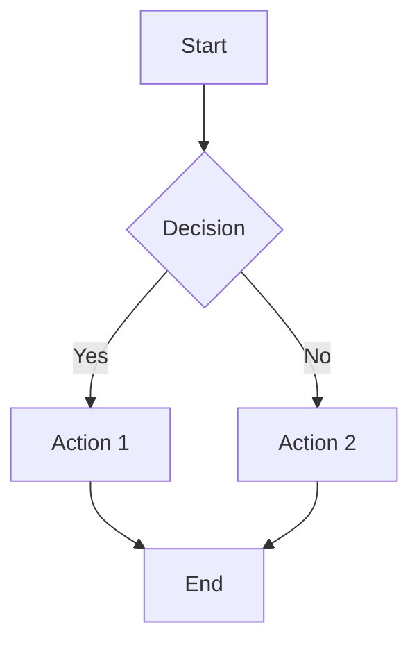

## 2. Flowchart (LR) — Supported

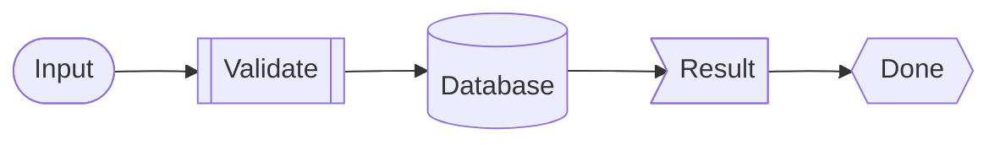

## 3. Graph (TD) — Supported

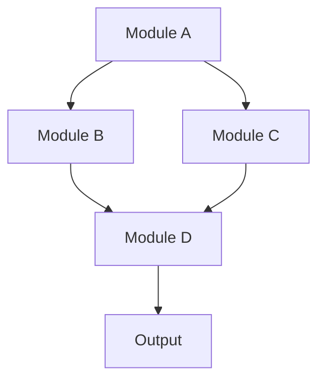

## 4. Graph (LR) — Supported

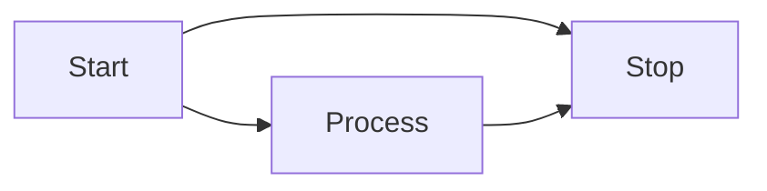

## 5. Flowchart with Subgraphs — Supported

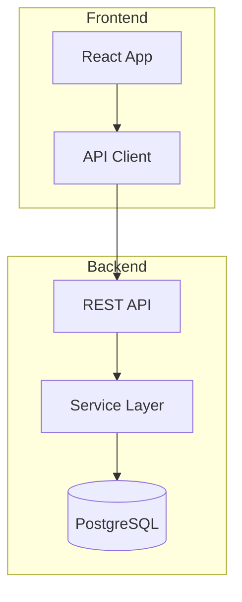

## 6. Flowchart with Styles — Supported

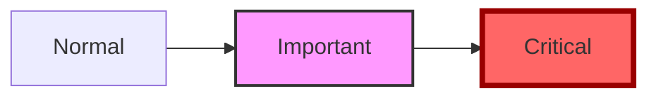

---

## 7. Sequence Diagram — Unsupported (fallback to code)

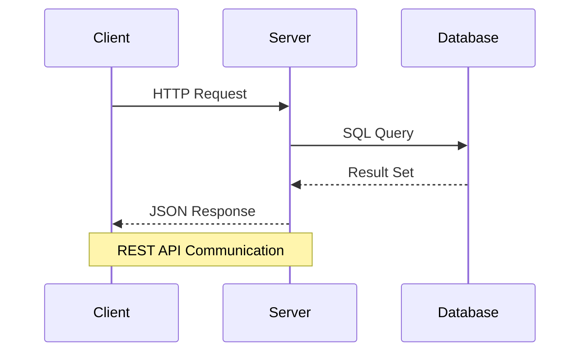

## 8. ER Diagram — Unsupported (fallback to code)

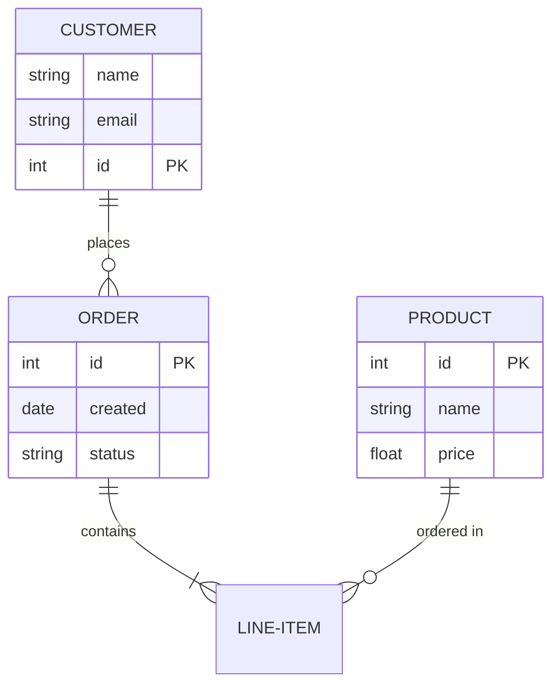

## 9. Class Diagram — Unsupported (fallback to code)

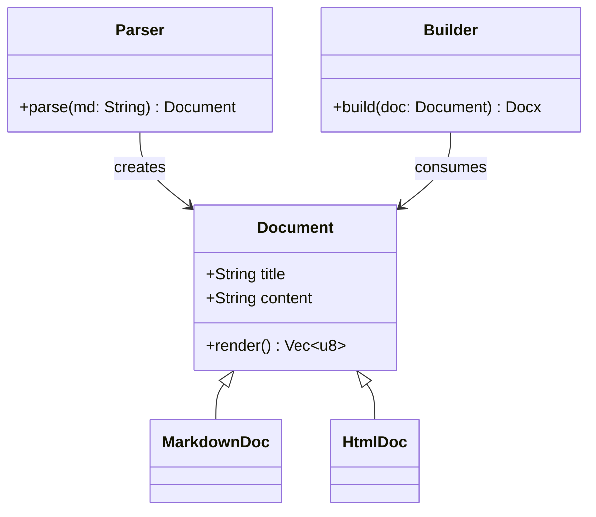

## 10. State Diagram — Unsupported (fallback to code)

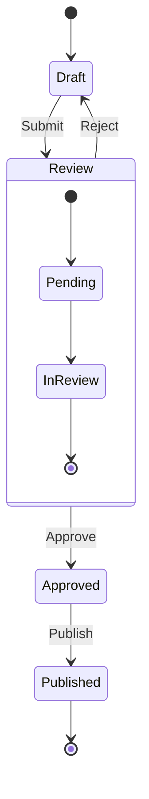

## 11. Gantt Chart — Unsupported (fallback to code)

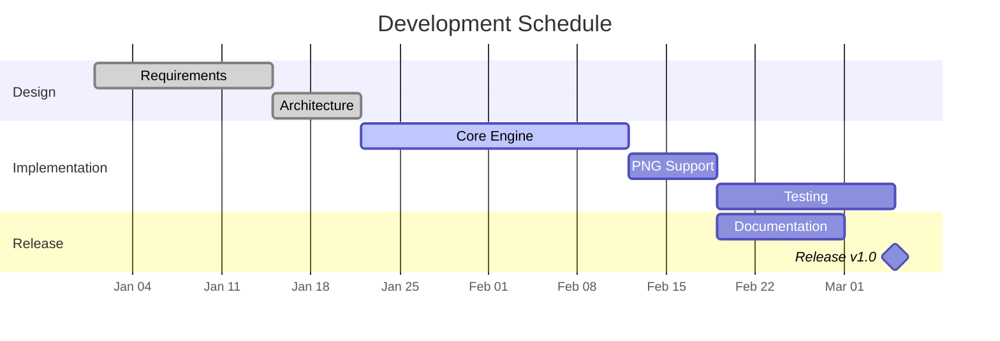

## 12. Pie Chart — Unsupported (fallback to code)

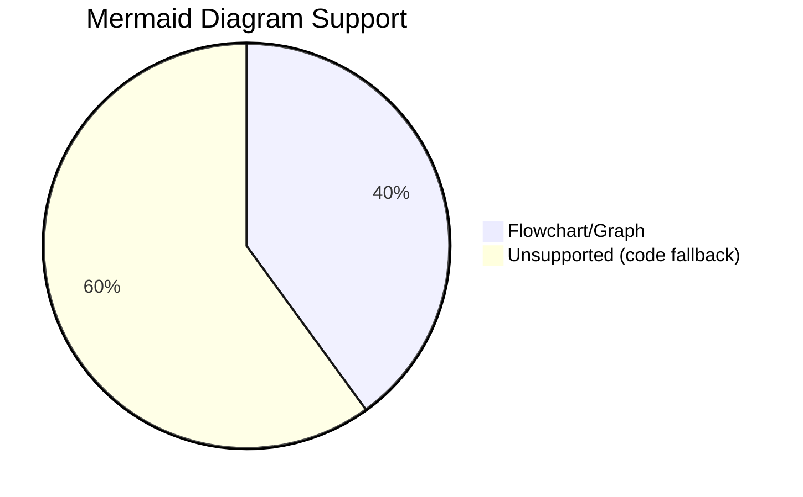

## 13. User Journey — Unsupported (fallback to code)

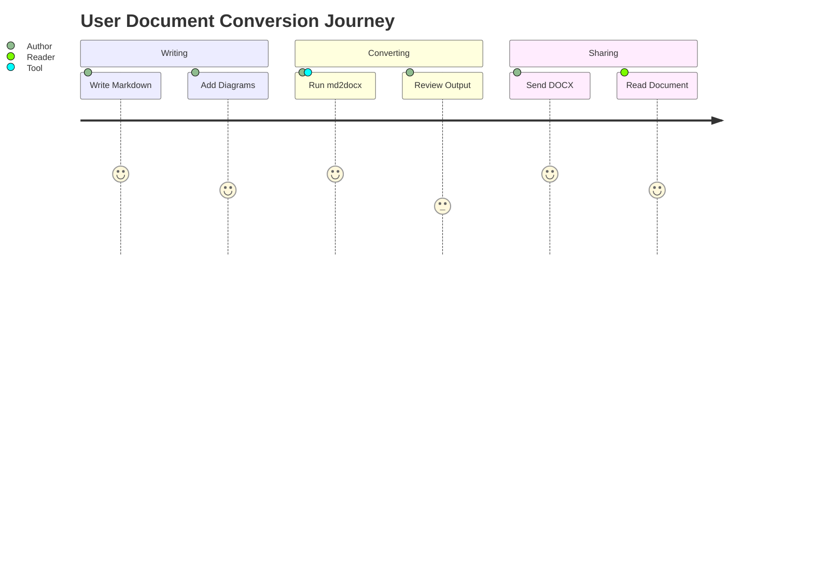

## 14. Git Graph — Unsupported (fallback to code)

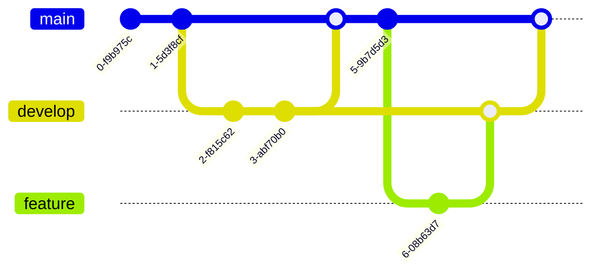

## 15. Mindmap — Unsupported (fallback to code)

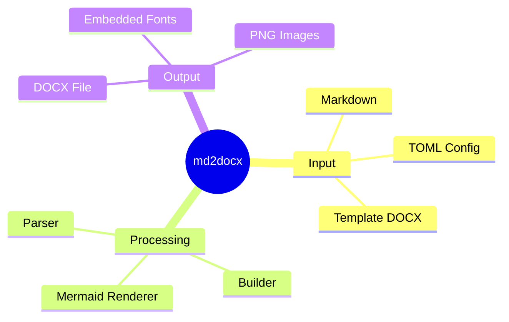

## 16. Timeline — Unsupported (fallback to code)

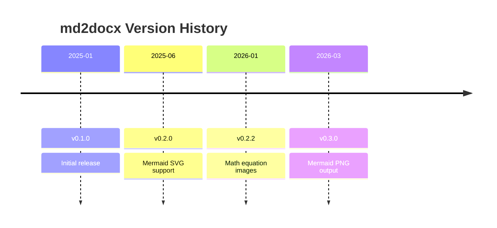

## 17. Quadrant Chart — Unsupported (fallback to code)

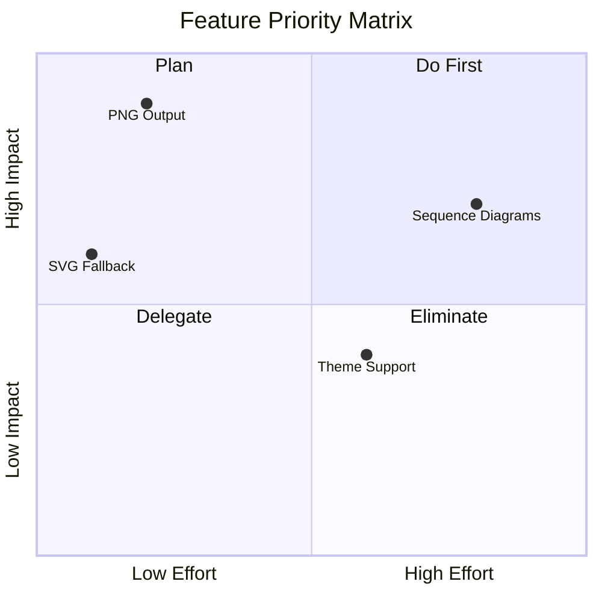

## 18. Sankey Diagram — Unsupported (fallback to code)

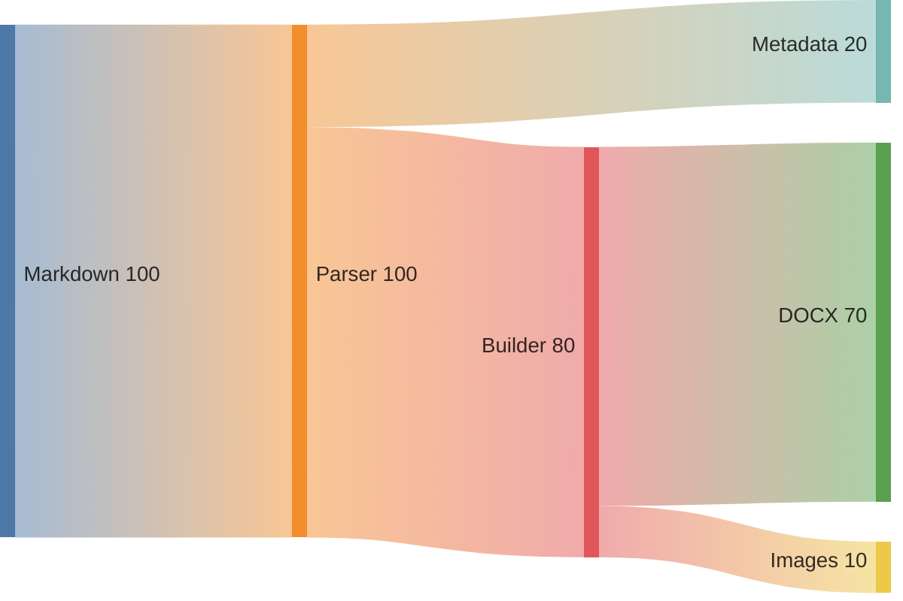

## 19. Block Diagram — Unsupported (fallback to code)

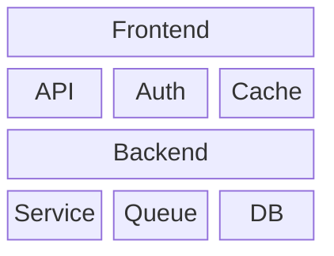

---

## Summary

| # | Diagram Type | Status |
|---|-------------|--------|
| 1 | flowchart TD | **Rendered as PNG** |
| 2 | flowchart LR | **Rendered as PNG** |
| 3 | graph TD | **Rendered as PNG** |
| 4 | graph LR | **Rendered as PNG** |
| 5 | flowchart (subgraphs) | **Rendered as PNG** |
| 6 | flowchart (styles) | **Rendered as PNG** |
| 7 | sequenceDiagram | Fallback to code |
| 8 | erDiagram | Fallback to code |
| 9 | classDiagram | Fallback to code |
| 10 | stateDiagram | Fallback to code |
| 11 | gantt | Fallback to code |
| 12 | pie | Fallback to code |
| 13 | journey | Fallback to code |
| 14 | gitGraph | Fallback to code |
| 15 | mindmap | Fallback to code |
| 16 | timeline | Fallback to code |
| 17 | quadrantChart | Fallback to code |
| 18 | sankey | Fallback to code |
| 19 | block-beta | Fallback to code |
