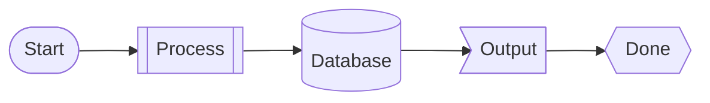

# Mermaid Diagram Demo

This document demonstrates various Mermaid diagram types rendered by md2docx.

## Flowchart

## Sequence Diagram

## Class Diagram

## State Diagram

## Gantt Chart

## Flowchart Shapes

